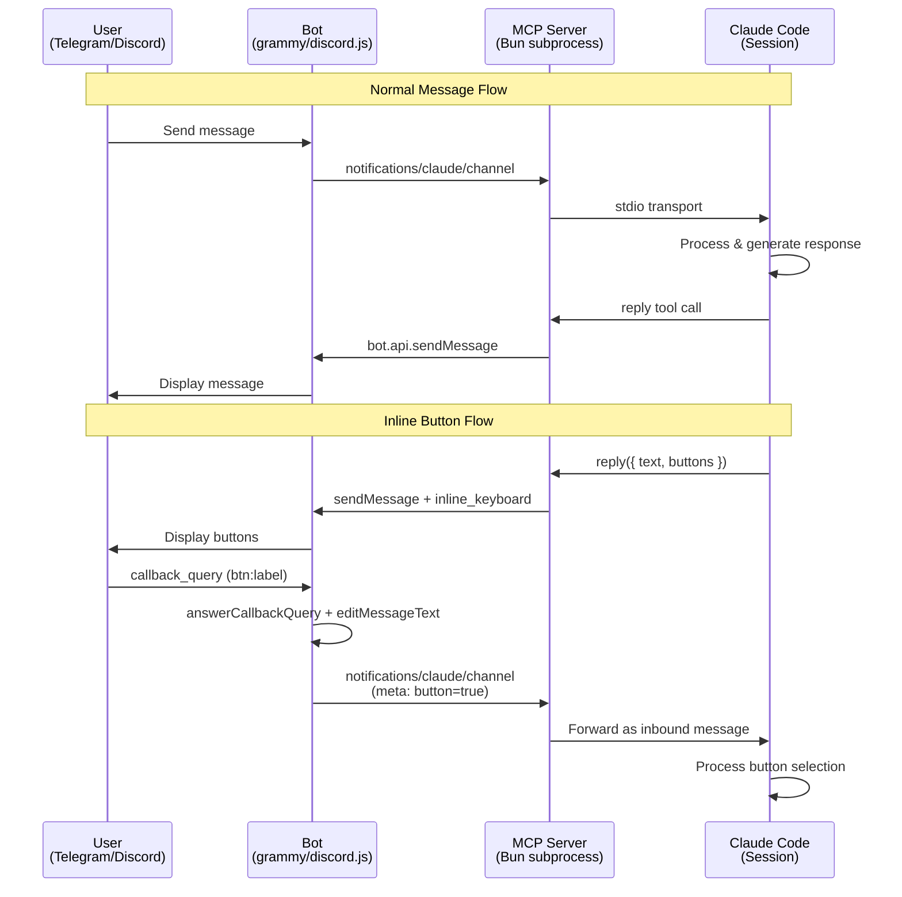



> **English Abstract** — Claude Code's `--channels` flag only accepts official plugin identifiers and re-extracts the plugin into a cache directory on every launch, overwriting local modifications. After trying 6 different approaches (pre-sync copy, background watcher, `--plugin-dir`, `--mcp-config`, symlink, and cache patching), we found that **cache patching** — rewriting the cached `.mcp.json` to redirect `--cwd` to a local fork — is the cleanest workaround: idempotent, no residual state, and compatible with inbound channel notifications. This article also covers implementing Telegram inline keyboard buttons via raw Bot API format (bypassing grammy's serialization issue), callback query handling, and credential isolation with `TELEGRAM_STATE_DIR`.

## 前言

[claude-code-channels](https://github.com/osisdie/claude-code-channels) 是一個讓 Claude Code 透過 Telegram、Discord、Slack、LINE、WhatsApp 等通訊平台互動的開源專案。每個 channel 都是一個 MCP server，以 Bun subprocess 的形式運行，透過 stdio transport 與 Claude Code session 溝通。

今天的目標看似簡單：讓 Telegram 的 `reply` tool 支援 **inline keyboard buttons**。實作按鈕本身不難，但在過程中踩到了 Claude Code plugin cache 的覆蓋機制，最終花了更多時間在架構問題上。這篇文章記錄完整過程。

---

## Channel 資料流

以下是完整的 channel message 流程。上半部是一般的文字訊息，下半部是本文新增的 inline button 互動流程：



---

## Telegram Inline Buttons 實作

### 需求

當 Claude 需要用戶回應一組固定選項時（Yes/No、Approve/Reject、1~5 數字），讓用戶直接按按鈕比打字更直覺。官方 Telegram plugin 的 `reply` tool 只支援純文字，沒有按鈕參數。

### 方案設計

在 `reply` tool 加一個 optional `buttons` 參數，二維字串陣列，每個內層陣列代表一排按鈕：

```typescript
// Claude 可以發送任意按鈕組合
reply({ chat_id, text: "確認部署?", buttons: [["Yes", "No"]] })
reply({ chat_id, text: "選擇方案:", buttons: [["方案A", "方案B"], ["取消"]] })
```

### 實際效果



截圖展示了三種常見的互動場景：

- **部署確認** — 二選一的 Approve/Reject，按下後按鈕消失並顯示結果
- **功能評分** — 單排 5 個數字按鈕，適合量化回饋
- **方案選擇** — 兩排按鈕（多選項 + 跳過），支援任意排列組合

每次按鈕點擊都會作為 inbound message 回傳給 Claude Code session，meta 帶 `button: "true"` 標記，Claude 可以直接根據選擇繼續執行。

### 關鍵技術決策

**使用 raw Telegram API format，而非 grammy 的 InlineKeyboard class。**

grammy 的 `InlineKeyboard` class 搭配 spread operator 傳入 `sendMessage` options 時，`reply_markup` 會在序列化過程中丟失 — API 回傳成功但 Telegram 不顯示按鈕。用 curl 直接呼叫 Bot API 測試正常，確認是 grammy class 的問題。改用 raw format 後立即解決：

```typescript
const replyMarkup = {
  inline_keyboard: buttons.map(row =>
    row.map(label => ({
      text: String(label),
      callback_data: `btn:${String(label).slice(0, 59)}`, // 64 bytes 上限
    }))
  ),
}
```

**按鈕點擊後的 Callback 處理：** 攔截 `btn:` prefix 的 `callback_query`，三步完成：

1. `answerCallbackQuery()` — 消除 Telegram loading 動畫
2. `editMessageText()` — 更新訊息顯示選擇結果（防止重複點擊）
3. `mcp.notification()` — 將按鈕 label 作為 inbound message 轉發給 Claude Code session（meta: `button=true`）

最後在 MCP server 的 `instructions` 加上一句引導：

> Prefer buttons over asking the user to type whenever the response is a small fixed set of choices.

這樣 Claude 在猜數字、確認操作等場景會主動使用 buttons，不需用戶提醒。

---

## Plugin Cache 覆蓋問題

### 發現問題

按鈕功能寫好了，直接改 `~/.claude/plugins/cache/claude-plugins-official/telegram/0.0.4/server.ts`，重啟 Claude Code，按鈕不出現。加了 diagnostic watermark 到回傳值：

```text
sent (id: 54)          ← 沒有 [local-v1] watermark
```

**確認：Claude Code 在 `--channels plugin:telegram@claude-plugins-official` 啟動時，會 re-extract 官方 plugin 到 cache，覆蓋所有修改。**

### 嘗試過的 6 種方案

| # | 方案 | 結果 |
|---|------|------|
| 1 | Pre-sync cp | x — re-extract 覆蓋 |
| 2 | Background watcher | x — race condition |
| 3 | `--plugin-dir` | x — 不支援 channel plugins |
| 4 | `--mcp-config` | x — 無 channel notification |
| 5 | Symlink | △ — 可行，殘留管理麻煩 |
| 6 | **Cache patching** | **&#10003; 穩定、無殘留、idempotent** |

### Bun Transpile Cache 的額外坑

即使成功把修改放進 cache，重啟後仍可能跑舊 code。原因是 **bun 會 cache transpiled TypeScript**，即使 `server.ts` 檔案改了，bun 仍可能使用舊的 cached bytecode。需要 `rm -rf /tmp/bun-*` 清除。

這個問題已開 upstream issue：[anthropics/claude-plugins-official#1057](https://github.com/anthropics/claude-plugins-official/issues/1057)

---

## Cache Patching 架構

最終採用的方案：將官方 plugin fork 到專案裡做版控，啟動時改寫 plugin cache 的啟動設定（`.mcp.json`），讓 Claude Code 跑我們的 fork code。

### 工作原理

Claude Code 啟動 `--channels plugin:telegram@claude-plugins-official` 時，會把官方 plugin 解壓到 cache 目錄。Cache patching **不改 `server.ts`**，而是改寫 cache 裡的 `.mcp.json`，把 `--cwd` 指向專案裡的 local fork：

`~/.claude/plugins/cache/.../telegram/0.0.4/.mcp.json`（改寫後）：

```json
{
  "mcpServers": {
    "telegram": {
      "command": "bun",
      "args": ["run", "--cwd", "<project>/external_plugins/telegram-channel/", "server.ts"],
      "env": { "TELEGRAM_STATE_DIR": "<project>/.claude/channels/telegram" }
    }
  }
}
```

這樣 Claude Code 仍用官方 plugin identifier 啟動（保留 inbound notification 路由），但實際執行的是我們 fork 過的 code：

```text
<project>/external_plugins/telegram-channel/
    ├── .mcp.json
    ├── server.ts          ← fork（版控裡的 source of truth）
    ├── skills/
    └── node_modules/
```

**為什麼不用 symlink？** Symlink 方案可行，但會留下殘留檔案（`.official` 備份目錄），升級時也需要額外清理。Cache patching 是 **idempotent** 的 — 每次啟動重新寫入，不殘留任何狀態。

### 通用場景

Cache patching 不限於 Telegram — **任何** `--channels plugin:xxx@claude-plugins-official` 都適用同一套機制。只要將官方 plugin fork 到 `external_plugins/<channel>-channel/`，啟動腳本就能自動改寫對應的 `.mcp.json`。目前 [claude-code-channels](https://github.com/osisdie/claude-code-channels) 已對 Telegram 和 Discord 使用此方案。

適用條件：

- 需要修改官方 channel plugin 的行為（加功能、修 bug、改 skill 路徑）
- 需要保留官方 plugin identifier 的 inbound notification 路由
- 不想維護 symlink 或其他有狀態的 workaround

### 重要設定：`channelsEnabled`

Claude Code 的 channel notification（inbound 訊息）預設是關閉的。需要在 settings 裡開啟：

```json
{
  "channelsEnabled": true
}
```

**沒有這個設定，outbound（發訊息）正常運作，但 inbound 會被靜默丟棄** — 這是最容易被忽略的坑。

### Credential 與 STATE_DIR 隔離

Bot token 和 access control 只存在**專案目錄**內（透過 `TELEGRAM_STATE_DIR` 環境變數指定），不會暴露到 `~/.claude/channels/telegram/` 這個全域路徑。這確保每個專案的 credentials 互相隔離，不會被其他 Claude Code session 讀取。

官方 plugin 的 skills（`/telegram:access`、`/telegram:configure`）原本把路徑 hardcode 為 `~/.claude/channels/telegram/`，導致設定 `TELEGRAM_STATE_DIR` 後 pairing 失敗。Fork 後修復：skills 改用 `$STATE` shorthand，由 `$TELEGRAM_STATE_DIR` 解析，fallback 到 global。同樣的修復也套用到 Discord plugin 和 `ACCESS.md` 文件。

---

## 總結

### Takeaways

1. **Plugin 開發最大障礙**：Claude Code 的 `--channels` 只接受官方 plugin identifier，啟動時會 re-extract 覆蓋 cache。目前沒有官方的 local plugin 載入方式。

2. **Cache patching 是最乾淨的 workaround**：改寫 plugin cache 的啟動設定指向 local fork，idempotent 且無殘留，比 symlink、pre-sync、background watcher 都穩定。

3. **`channelsEnabled: true` 容易被忽略**：沒有這個設定，outbound 正常但 inbound 被靜默丟棄，debug 時很容易誤判為 bot polling 問題。

4. **Bun transpile cache 是隱性坑**：改了 TypeScript 原始碼，bun 可能仍跑舊版本。清 `/tmp/bun-*` 或設定 `BUN_DISABLE_CACHE=1` 可解。

5. **建議官方改進**：
   - `--channels` 支援 local path（類似 `--plugin-dir`）
   - Plugin 啟動時加 `--no-cache` 避免 transpile cache 問題

### 相關連結

- [claude-code-channels](https://github.com/osisdie/claude-code-channels) — 本專案
- [anthropics/claude-plugins-official#1057](https://github.com/anthropics/claude-plugins-official/issues/1057) — Bun cache issue
