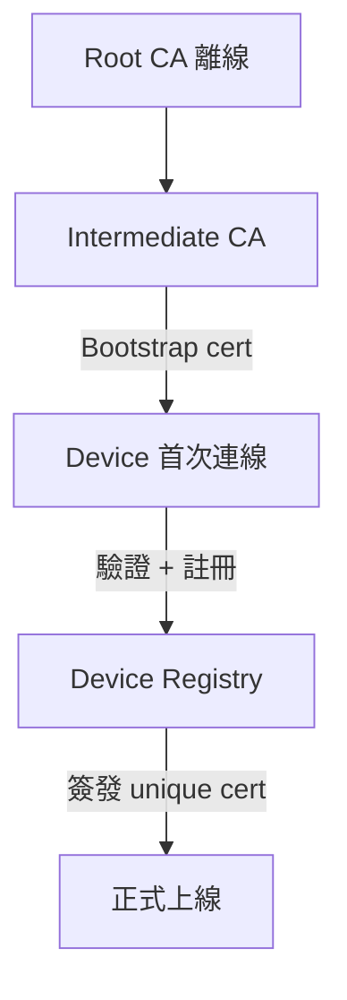



> **English Abstract** — Part 2 of 3. Device security: **mTLS X.509** with software-based certificate rotation (90-365d), JIT provisioning, anti-spoofing measures. Multi-tenancy: MQTT **Topic ACL** namespace isolation, PostgreSQL **Row-Level Security**, 4-role **RBAC** model, dual-layer command authorization.

> **系列文章：** [Part 1 核心架構](/blog/2026/iot-1m-device-architecture/) | Part 2 安全與多租戶（本篇）| [Part 3 運維與可靠性](/blog/2026/iot-1m-device-architecture-part3/)

---

## Device Identity

### 認證方式

| 方式 | 安全性 | 適用 |
|---|---|---|
| **mTLS (X.509)** | 最高 | **預設** — ESP32+，CA chain 免存 per-device credential |
| PSK | 中 | 受限設備 / gateway 後方 |
| JWT | 高 | OAuth2 生態整合 |

MAC 可偽造、serial 可猜測 — **Device ID 必須搭配密碼學憑證**：
- MQTT Client ID：`{tenant}:{type}:{serial}`
- X.509 CN 匹配 Client ID → mTLS 自動綁定
- DB PK：UUID v4

### 通訊安全

| 層 | 機制 | 說明 |
|---|---|---|
| 傳輸 | TLS 1.2+ (8883) | 加密 + 完整性 |
| 身份 | mTLS 雙向驗證 | Broker 驗 device，device 驗 broker |
| 應用 | Payload HMAC (optional) | 防中間人改寫 |

**Certificate Rotation：**
- 有效期 90-365 天，到期前 30 天自動 CSR 換發
- 雙 CA chain 確保 rotation 不斷線
- 到期未更新 → CRL 撤銷 → 強制斷線 + 告警

### Provisioning



| 方式 | 安全 | 適用 |
|---|---|---|
| **JIT** | 高 | 一般 fleet（推薦） |
| Claim-based | 中 | 批量同型號 |
| API 預註冊 | 高 | 已知 device list |

**防偽裝：** One-time bootstrap token、Device fingerprint hash、Provisioning API rate limit、Allowlist/Denylist。

### EMQX 認證鏈

1. **mTLS** → cert CN 取 device identity（`peer_cert_as_clientid = cn`）
2. **JWT** → RS256 簽名 + claims 驗證
3. **HTTP** → 外部 auth service（legacy 設備）

EMQX 支援 CRL + OCSP Stapling — 設備 compromise 時即時撤銷。

---

## Multi-Tenancy

### Broker 隔離

| 模式 | 隔離 | 適用 |
|---|---|---|
| **共享 EMQX + Topic ACL** | 邏輯 | 95% 租戶 |
| Broker-per-tenant | 進程 | 法規要求（醫療/金融） |
| **混合** | 視 tier | **推薦** |

### Topic 命名空間

```
{tenant}/d/{device}/telemetry      # 遙測
{tenant}/d/{device}/cmd/request    # 指令
{tenant}/d/{device}/cmd/response   # 回應
{tenant}/d/{device}/config/desired # 期望組態
{tenant}/g/{group}/cmd/request     # 群組廣播
```

Tenant ID 永遠第一層 → ACL 前綴比對。設備禁止 wildcard subscribe。

### RBAC

| 權限 | Super Admin | Tenant Admin | Operator | Viewer |
|---|:---:|:---:|:---:|:---:|
| 管理 tenants | ✓ | | | |
| 註冊/停用設備 | ✓ | ✓ | | |
| 發送任意指令 | ✓ | ✓ | | |
| 發送預核准指令 | ✓ | ✓ | ✓ | |
| 查看 Dashboard | ✓ | ✓ | ✓ | ✓ |
| OTA 部署 | ✓ | ✓ | | |

### Command 雙層驗證

- **API 端：** User role + command 權限 + device status + rate limit
- **Device 端：** 驗簽名（防 injection）+ 驗 timestamp（防 replay）+ 驗 command_type

### DB Tenant 隔離

| 策略 | 隔離 | 適用 |
|---|---|---|
| **Row-Level Security** | 邏輯 | **預設** |
| Schema-per-tenant | 中 | 中等需求 |
| DB-per-tenant | 最強 | Enterprise |

TimescaleDB 按 `(tenant_id, time)` 分區 → 查詢自動 pruning，可按 tenant 設定不同 retention。

---

## 下一篇

- [Part 1：核心架構](/blog/2026/iot-1m-device-architecture/) — EMQX + TimescaleDB + FastAPI + BFF、成本估算
- [Part 3：運維與可靠性](/blog/2026/iot-1m-device-architecture-part3/) — Rate Limiting、Edge Resilience、DR、Observability
