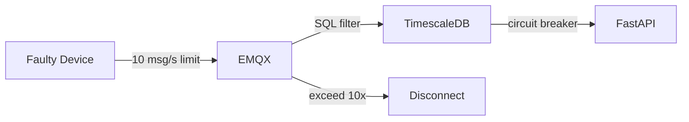
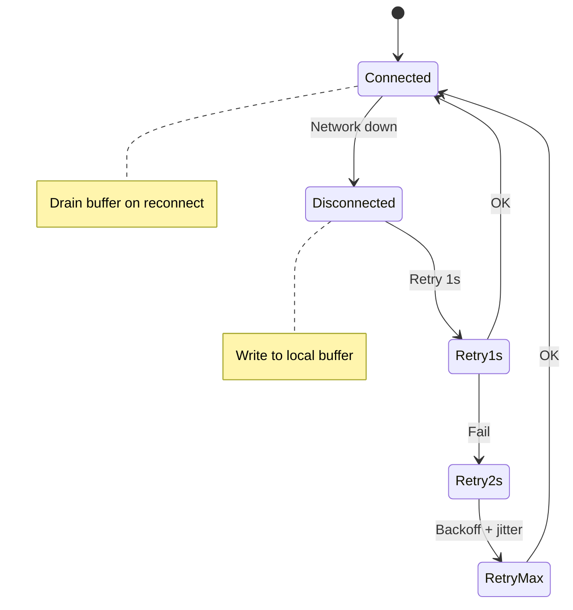
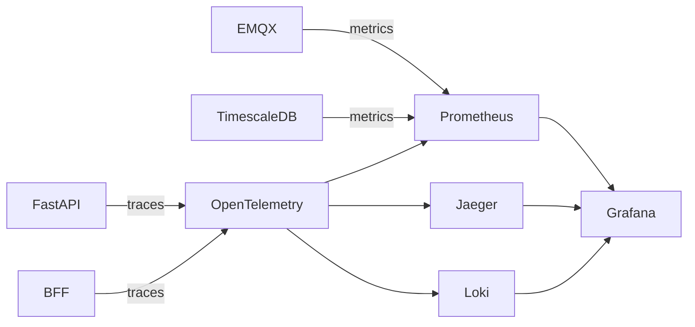



> **English Abstract** — Part 3 of 3. Operations: three-layer **rate limiting** (EMQX → Rule Engine → App), content-based **dedup**, anomaly detection. Edge resilience: **exponential backoff + jitter**, offline buffering (RAM/SQLite/MQTT Session Expiry). Server HA with RPO/RTO per component. **OpenTelemetry** end-to-end tracing. Multi-region DR (Active-Passive). Team onboarding risk and phased rollout.

> **系列文章：** [Part 1 核心架構](/blog/2026/iot-1m-device-architecture/) | [Part 2 安全與多租戶](/blog/2026/iot-1m-device-architecture-part2/) | Part 3 運維與可靠性（本篇）

---

## Rate Limiting + Dedup

設備異常（firmware bug、sensor malfunction）可能瞬間灌入大量資料：



| 層 | 限制 | 超限動作 | 說明 |
|---|---|---|---|
| **EMQX** | 10 msg/s, 50 KB/s | Throttle → disconnect | 第一道防線，per-client |
| **Rule Engine** | SQL filter + dedup | 丟棄不符條件 | 基本過濾，無需代碼 |
| **FastAPI** | Per-tenant rate limit | Alert + reject | 業務邏輯層防護 |

### Dedup 策略

| 層 | 策略 |
|---|---|
| MQTT Broker | Packet ID tracking |
| Rule Engine | SQL WHERE + timestamp 比對 |
| Application | `(device_id, timestamp, hash)` |
| Database | `ON CONFLICT DO NOTHING` |

### 異常偵測

| 類型 | 偵測 | 處理 |
|---|---|---|
| 超頻上報 | Rate > 10x | Broker throttle |
| 範圍異常 | 超 physical range | 丟棄 + 告警 |
| 時序異常 | 偏差 > 5min | 標記 suspect |
| 靜默設備 | > 3x 正常間隔 | LWT → offline 告警 |

---

## Edge Resilience

### Reconnect + Offline Buffer



| Buffer | 容量 | 持久性 | 適用 |
|---|---|---|---|
| Ring buffer (RAM) | 1-10K msg | 斷電失 | MCU |
| SQLite on flash | 100K+ msg | 持久 | Gateway |
| MQTT v5 Session Expiry | Broker 端 | Broker 存活時 | 所有 |

QoS 1：PUBLISH → 等 PUBACK → timeout 5s → pending → 重連後重送。搭配 application dedup 不重複。

### Thundering Herd

Broker 恢復 → 1M 設備同時重連。Device jitter 分散 0-5min + EMQX `max_conn_rate=10000/s` → 100s 有序恢復。

---

## Server-Side HA

| 組件 | HA 策略 | RPO | RTO |
|---|---|---|---|
| EMQX | 3-5 node RAFT | 0 | <30s |
| TimescaleDB | Patroni + streaming replication | ~0 | <30s |
| ClickHouse | ReplicatedMergeTree | ~0 | <60s |
| FastAPI | K8s 3+ replicas | — | <5s |

### Multi-Region DR

| 層 | AWS | GCP |
|---|---|---|
| MQTT | EMQX cluster linking | 跨 Zone |
| DB | RDS cross-region replica | Cloud SQL cross-region |
| Cold | S3 CRR | GCS Dual-Region |
| DNS | Route 53 failover | Cloud DNS routing |

**Active-Passive：** Primary 處理流量，Secondary 有 replica，DNS failover → RPO ~min, RTO ~5-10min。

---

## Observability

**Day 1 就做好**，不是事後補。



| 組件 | 監控重點 | 告警閾值 |
|---|---|---|
| EMQX | 連線數、msg rate、Rule Engine | > 900K、deny > 1% |
| TimescaleDB | Write throughput、disk | < 80K/s、> 80% |
| FastAPI | Latency、error rate | P99 > 200ms |
| BFF | WS connections | > 10K |

每條 telemetry 帶 `trace_id`（Rule Engine 注入），Jaeger 一鍵查 device → Dashboard 完整鏈路。

---

## 雲端 vs 地端

| 服務 | AWS | GCP | 地端 |
|---|---|---|---|
| Broker | EMQX Cloud | EMQX Cloud | EMQX on K8s |
| K8s | EKS | GKE Autopilot | K3s |
| Hot DB | Timescale Cloud | Timescale Cloud | VM |
| Warm DB | ClickHouse Cloud | ClickHouse Cloud | K8s |
| Cold | S3 | GCS | MinIO |
| Cold 查詢 | Athena | BigQuery | DuckDB |
| 監控 | CloudWatch | Cloud Monitoring | Grafana |
| 月費 | ~$17-33K | ~$17-33K | ~$8-15K + ops |

GKE Autopilot 比 EKS 易上手。BigQuery 按 scan 計價對 IoT 分析較划算。

---

## 團隊與交付風險

| 風險 | 緩解 | 說明 |
|---|---|---|
| 核心 4 系統運維 | OTel Day 1 + Grafana | 統一 dashboard 降低認知負擔 |
| 新人 2-3 月上手 | 從極簡版開始 | 逐步加組件，避免一次全上 |
| 多租戶 ACL 出錯 | Unit test + staging | 配錯即資安事件 |
| 成本超預期 | PoC 10 萬裝置 | 精算後再決定 managed vs self-hosted |

**導入順序：**

```
Phase 1 (Month 1-2): EMQX + TimescaleDB + FastAPI + BFF + OTel
Phase 2 (Month 3-4): + ClickHouse + S3
Phase 3 (Month 5-6): + Multi-tenant + DR
Phase 4 (>1M):       + Redpanda + FastStream
```

---

## 後續考慮

- **OTA firmware update pipeline**
- **Edge computing / gateway aggregation**
- **Active-Active geo-replication**（EMQX cluster linking + CRDT）

---

## 系列連結

- [Part 1：核心架構](/blog/2026/iot-1m-device-architecture/) — EMQX + TimescaleDB + FastAPI + BFF、成本估算
- [Part 2：安全與多租戶](/blog/2026/iot-1m-device-architecture-part2/) — mTLS、Cert Rotation、RBAC、Topic ACL
- [Redpanda Documentation](https://docs.redpanda.com/) — Event Streaming（Scale-out >1M）
