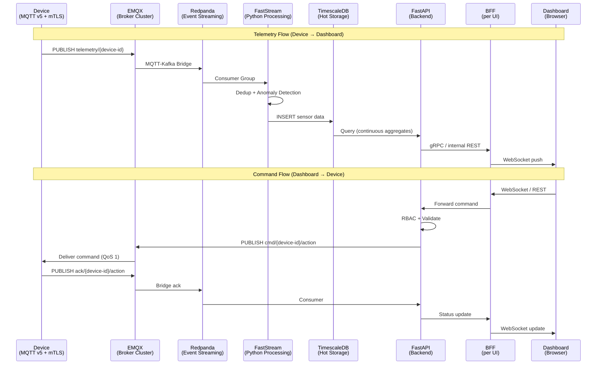
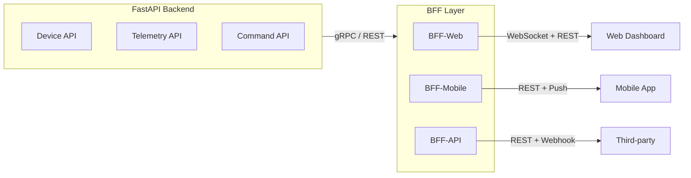
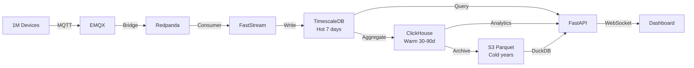
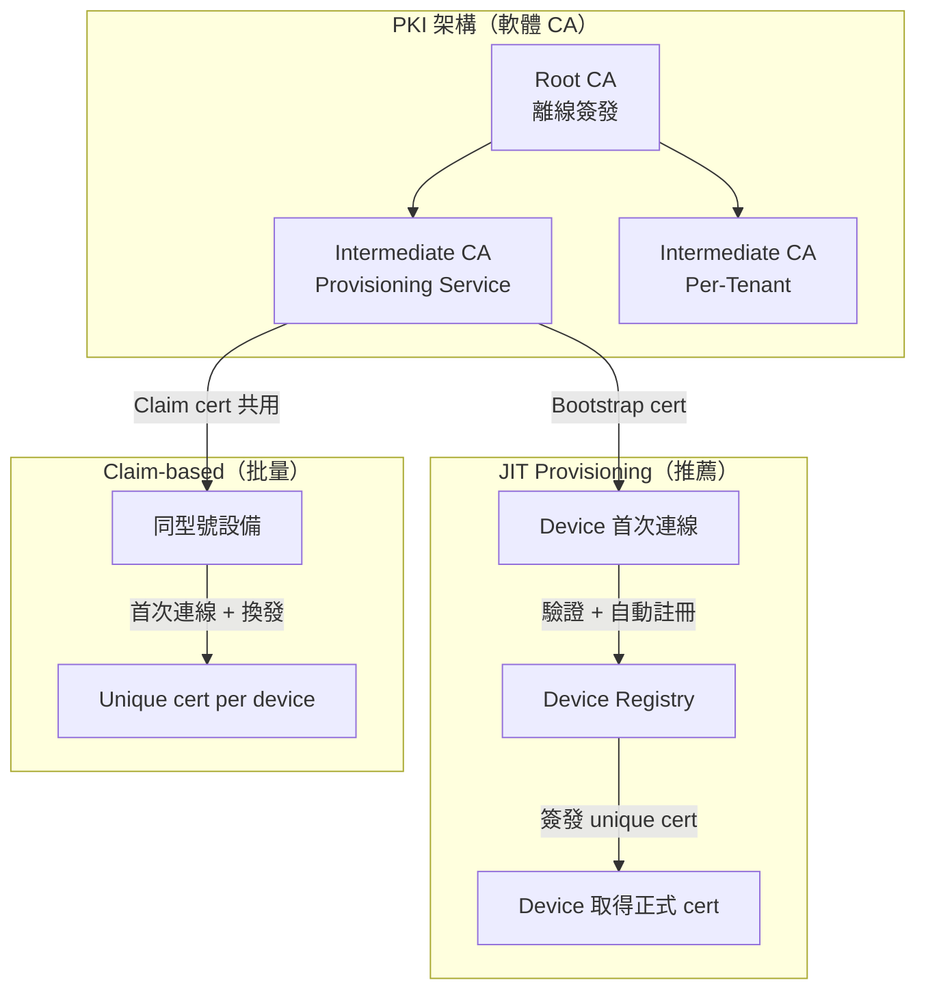
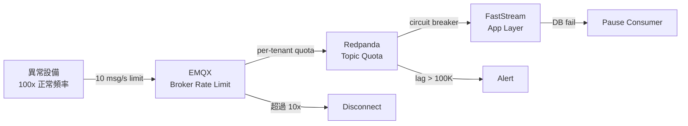
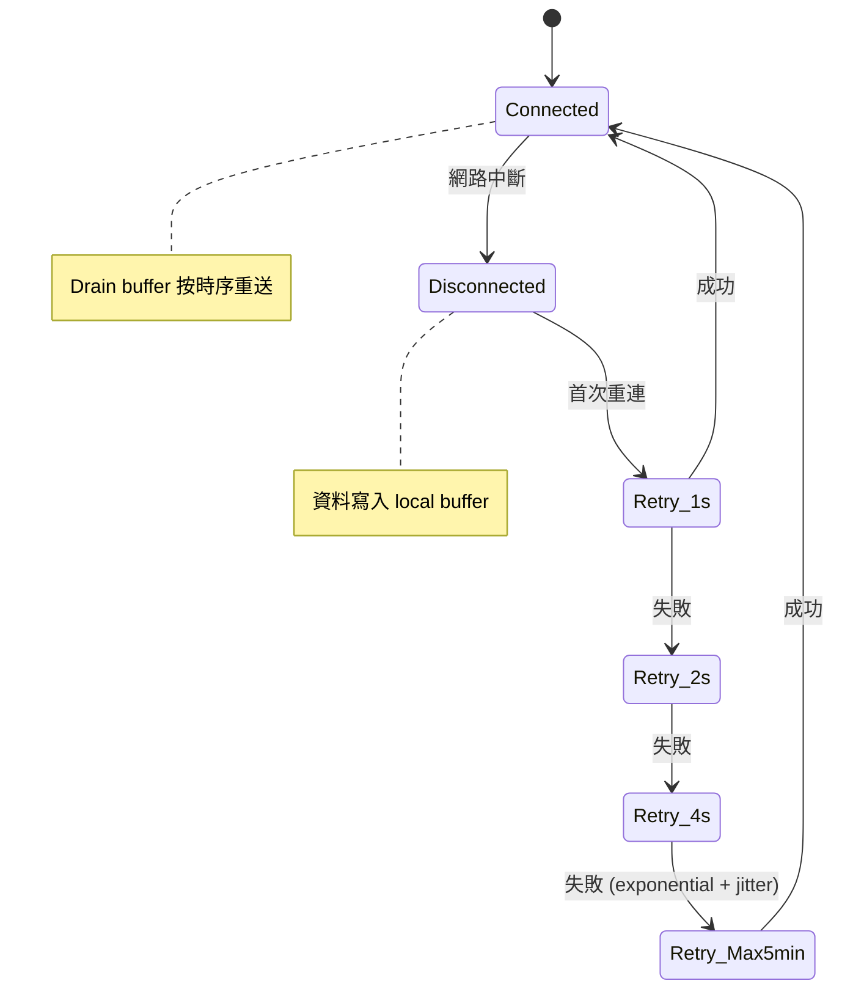
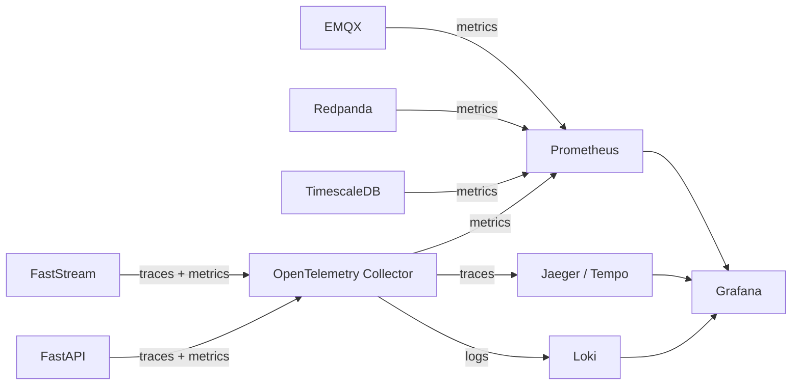
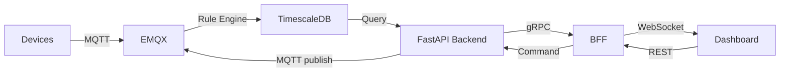



> **English Abstract** — A phased IoT architecture for 1M concurrent devices. **Phase 1** (MVP): **EMQX** MQTT v5 broker → **TimescaleDB** (hot 7d + Continuous Aggregates) → **FastAPI** backend → **BFF** (Backend for Frontend, per-UI WebSocket management and API aggregation) → Dashboard. Security via **mTLS X.509** with software-based certificate rotation, multi-tenant isolation via MQTT topic ACLs + PostgreSQL RLS, and **OpenTelemetry** observability across all systems. **Scale-out** (10M+): add Redpanda event streaming, ClickHouse OLAP, Flink CEP, multi-region DR. Includes cost estimation (~$22-43K/month at 1M), 4-phase rollout plan, and simplified alternatives for smaller deployments (<100K devices). All services are cloud-neutral with AWS/GCP mapping.

## 前言

如果你要管理 **1 百萬台現場設備**，每台每 10 秒回報一次 sensor 資料，這意味著：

- **100K writes/sec** 持續寫入
- **~1.7 TB/day** 原始資料量
- 需要**即時**反映在後台 Dashboard
- 還要能從 Dashboard **反向下指令**到特定設備
- 設備可能異常狂發資料、偽造身份、或在斷網後大量重連

這篇文章採用**漸進式架構**設計 — Phase 1 只需 4 個核心組件（EMQX + TimescaleDB + FastAPI + BFF）即可上線，後續按需加入 Event Streaming、OLAP、Multi-Region DR。每個選擇都附上 AWS/GCP 對照和成本估算。

> **適用場景：** SaaS 型 IoT 專案（智慧製造、能源監控、車隊管理），需要即時 Dashboard + 長期冷熱分層儲存。Phase 1 適合 2-3 人團隊，完整版適合 8 人以上或有 SRE 支援的組織。文末附有不同規模的簡化方案。

---

## 架構資料流



**延遲取捨：** 全鏈路經 EMQX → Redpanda → FastStream 三層轉發，端到端延遲比直接 MQTT → DB 高約 50-150ms。這是用延遲換取解耦、可擴展性和 Dedup/Anomaly 處理能力的 trade-off。對 Dashboard 即時監控而言，sub-second 延遲完全可接受；對需要 <10ms 反應的控制迴路，應直接在 EMQX Rule Engine 處理。

---

## Python 後端：asyncio，非 Free Threading

**結論：Python Free Threading (PEP 703) 尚未 production-ready。**

| 版本 | 狀態 |
|---|---|
| Python 3.13t | 實驗性，單線程 5-10% 效能損失 |
| Python 3.14t (2026 Oct) | 仍標記 experimental，目標 <5% overhead |
| 預計正式版 | Python 3.16（~2028） |

1M 連線是 **I/O-bound** 工作，asyncio event loop 就是為此設計的。生態系（SQLAlchemy、paho-mqtt、FastAPI）未經 no-GIL 審計，C extensions 可能有 data race。

**推薦架構：**

```
HAProxy / nginx (L4 load balancer)
  ├── Uvicorn worker 1 (asyncio + uvloop, ~50-100K conn)
  ├── Uvicorn worker 2
  ├── ...
  └── Uvicorn worker N (per CPU core)
      └── Redis/NATS for cross-process pub/sub
```

- **uvloop** 替代預設 event loop（2-4x 效能提升）
- CPU-bound 工作用 `ProcessPoolExecutor` 分離
- 重新評估時機：Python 3.16+ 且關鍵依賴都有 `nogil` wheels

---

## 通訊協定：MQTT v5

| 協定 | 雙向 | 功耗 | Overhead | 適用場景 |
|---|---|---|---|---|
| **MQTT v5** | Yes (pub/sub) | 極低 | 2-byte min header | **IoT 預設選擇** |
| CoAP | 有限 (observe) | 極低 | UDP | NB-IoT 極端受限設備 |
| gRPC | Yes (streaming) | 高 | HTTP/2 + protobuf | 後端 service-to-service |
| AMQP | Yes | 高 | 重 | 企業訊息，不適合設備端 |

**MQTT v5 關鍵功能：** Request/Response correlation ID（指令 ack 配對）、Shared subscriptions（後端 consumer 負載均衡）、Message expiry（離線指令過期）、Retained messages（重連後取得最新狀態）、Last Will and Testament（自動離線偵測）。

---

## MQTT Broker：EMQX

| Broker | 1M 連線 | Clustering | 推薦度 |
|---|---|---|---|
| **EMQX** | ✓ (實測 100M+) | 原生 RAFT | ★★★★★ |
| HiveMQ | ✓ | 原生 | ★★★★ (商業) |
| VerneMQ | ✓ | Erlang | ★★★ (社群較小) |
| Mosquitto | x (~100K) | 無 | 僅 dev/edge |

**部署選項（AWS/GCP 對照）：**

| 選項 | AWS | GCP | 月費估算 |
|---|---|---|---|
| **EMQX Cloud Dedicated** | AWS 上部署 | GCP 上部署 | ~$15-30K |
| Self-hosted on K8s | EKS | GKE | ~$5-10K + ops |
| 雲端 Managed IoT | AWS IoT Core | ~~GCP IoT Core~~ (已停) | ~$80-120K |

資源估算：1M idle 連線 ≈ 2-4 GB RAM per node，3-5 node cluster。

---

## 即時 Monitor + 反向指令

### 設備狀態 → Dashboard（WebSocket）

```
Phase 1:  Device → MQTT → EMQX (Rule Engine) → TimescaleDB → FastAPI → BFF → WebSocket → Dashboard
Scale-out: Device → MQTT → EMQX → Redpanda → FastStream → TimescaleDB → FastAPI → BFF → Dashboard
```

用 **WebSocket** 而非 SSE，因為需要雙向（UI 也要發指令）。BFF 管理所有 WebSocket 連線，Backend 不直接面對瀏覽器。多個 BFF instance 間用 Redis Pub/Sub 同步。

### Dashboard → Device（反向指令）

```
Dashboard → BFF (REST/WS) → FastAPI Backend (validate + RBAC)
  → MQTT: cmd/{device-id}/{action} (QoS 1)
    → EMQX → Device → execute
      → MQTT: ack/{device-id}/{action}
        → Backend → BFF → WebSocket → Dashboard
```

**關鍵設計：** QoS 1（at-least-once），指令設計為 idempotent。MQTT v5 Correlation ID 配對 request/response。Timeout 10s，無 ack 標記 pending/failed。ACL 安全：每個設備只能 subscribe `cmd/{自己的 id}/#`。

### BFF (Backend for Frontend) 層

FastAPI Backend 是面向設備與資料的核心服務，不應直接服務前端 UI。不同前端（Web Dashboard、Mobile App、第三方 API）需要不同的資料格式、聚合粒度和認證方式。**BFF 層解耦前後端**，讓 Backend 專注在設備管理與資料處理。



**職責劃分：**

| 層 | 職責 | 不做什麼 |
|---|---|---|
| **FastAPI Backend** | Device CRUD、Telemetry 寫入/查詢、Command 下發、RBAC、MQTT 互動 | 不處理 UI 邏輯（分頁/排序/i18n） |
| **BFF** | UI 專屬聚合、WebSocket 管理、Response 裁切、Session 管理 | 不直連 DB 或 MQTT |

**BFF 實作選型：**

| 面向 | 選擇 | 說明 |
|---|---|---|
| 語言 | **FastAPI** 或 **Next.js API Routes** | 依前端團隊技術棧決定 |
| 部署 | 獨立 K8s Deployment | 可獨立擴縮，不影響 Backend |
| BFF → Backend | **gRPC** 或內部 REST | gRPC 效能好，REST 開發快 |
| 快取 | Redis | Device status cache、Dashboard 聚合快取 |
| WebSocket | **BFF 管理所有 WS 連線** | Backend 不面對瀏覽器 WS |

**Web BFF 具體功能：**
- **聚合查詢** — 把多個 Backend API 合成一次回應（device list + 最新 telemetry + alert count）
- **WebSocket 管理** — 維護 per-user WS 連線，訂閱該 user 有權限的 device 更新
- **Response 裁切** — Web 需要完整欄位，Mobile 只需精簡欄位
- **Per-user rate limit** — Backend 做 per-tenant limit，BFF 做 per-user limit
- **i18n / 時區** — 根據 user locale 轉換日期格式、單位

---

## Event-Driven Data Processing

### Event Streaming：Redpanda

| | Redpanda | Kafka | NATS JetStream |
|---|---|---|---|
| 吞吐量 | 1M+ msg/sec/node | 1M+ msg/sec/broker | ~500K msg/sec |
| P99 延遲 | 1-5ms | 5-15ms | 2-5ms |
| 運維複雜度 | **低** (single binary) | 高 (KRaft) | 極低 |
| API 相容 | Kafka API | — | 自有 |

選 Redpanda：Kafka 生態相容 + 更簡單運維 + 更低尾延遲。

### Stream Processing：Benthos + FastStream

| 層 | 工具 | 職責 |
|---|---|---|
| 路由/過濾/格式轉換 | **Benthos** (YAML) | 無需寫 code |
| Python 業務邏輯 | **FastStream** | 異常偵測、閾值告警、聚合 |
| 複雜 CEP (optional) | **Flink** | 跨設備跨時間窗關聯分析 |

90% 的 IoT 場景 Benthos + FastStream 就夠，不需要 Flink。

---

## 三層儲存策略

**寫入量：** 1M 設備 x 每 10 秒 1 筆 = **100K writes/sec**，~1.7 TB/day raw

| 層 | DB | 保留 | 解析度 | 查詢延遲 | 月成本/TB |
|---|---|---|---|---|---|
| **Hot** | TimescaleDB | 7 days | 原始 | <10ms | ~$200 (NVMe) |
| **Warm** | ClickHouse | 30-90d | 1min/5min 聚合 | 50-500ms | ~$50 |
| **Cold** | S3 + Parquet | 年 | 時/日聚合 | 秒級 | ~$2-5 |

**TimescaleDB (Hot)：** 完整 PostgreSQL SQL，Python 生態零摩擦，Continuous aggregates 自動聚合，PostGIS 支援。

**ClickHouse (Warm)：** 95%+ 壓縮率（業界最佳），MergeTree + TTL 自動管理，可直接查詢 S3 Parquet。

**Cold tier：** TimescaleDB `drop_chunks` + ClickHouse TTL 自動降級，Parquet 歸檔到 S3/GCS，用 DuckDB 做 ad-hoc 查詢。

### Dashboard 查詢優化：Materialized Views

直接對原始資料表做 Dashboard 查詢在 1M 設備規模下會成為瓶頸。**Continuous Aggregates** 是關鍵：

| 層 | 機制 | 效果 |
|---|---|---|
| TimescaleDB | Continuous Aggregates (1min / 5min / 1hr) | 自動預聚合，Dashboard 查詢快 10-100x |
| ClickHouse | Materialized Views + AggregatingMergeTree | 寫入時即聚合，分析查詢零延遲 |

```sql
-- TimescaleDB: 自動建立 1 分鐘聚合
CREATE MATERIALIZED VIEW sensor_1min
WITH (timescaledb.continuous) AS
SELECT
  time_bucket('1 minute', time) AS bucket,
  device_id,
  avg(temperature) AS avg_temp,
  max(temperature) AS max_temp,
  count(*) AS sample_count
FROM telemetry
GROUP BY bucket, device_id;

-- 自動刷新策略
SELECT add_continuous_aggregate_policy('sensor_1min',
  start_offset => INTERVAL '1 hour',
  end_offset   => INTERVAL '1 minute',
  schedule_interval => INTERVAL '1 minute');
```

Dashboard 改查 `sensor_1min` 而非 `telemetry`，查詢量降低 600x（10 秒一筆 → 1 分鐘一筆 x 聚合後欄位更少）。



---

## 雲端 vs 地端（AWS/GCP 對照）

> **為什麼以 AWS 為主要參照？** AWS IoT 生態最成熟，市占率最高。但所有選型均為**雲端中立**的開源/第三方服務，可無縫遷移至 GCP 或地端。GCP IoT Core 已於 2023 年停止服務。

| 服務層 | AWS | GCP | 地端 |
|---|---|---|---|
| MQTT Broker | EMQX Cloud (AWS) | EMQX Cloud (GCP) | EMQX on K8s |
| K8s | EKS | GKE Autopilot | K3s / Rancher |
| Streaming | Redpanda Cloud / MSK | Redpanda Cloud | Redpanda on K8s |
| Hot DB | Timescale Cloud | Timescale Cloud | TimescaleDB on VM |
| Warm DB | ClickHouse Cloud | ClickHouse Cloud | ClickHouse on K8s |
| Cold Storage | S3 | GCS | MinIO |
| Cold 查詢 | Athena | BigQuery | DuckDB |
| Pub/Sub | SNS/SQS | Cloud Pub/Sub | NATS / Redis |
| Load Balancer | ALB/NLB | Cloud LB | HAProxy / nginx |
| 監控 | CloudWatch | Cloud Monitoring | Grafana + Prometheus |
| Secrets | Secrets Manager | Secret Manager | HashiCorp Vault |
| 估算月費 | ~$30-50K | ~$30-50K | ~$10-20K + ops |

**GCP 特別注意：** GKE Autopilot 比 EKS 更易上手。BigQuery 對 IoT 分析查詢有價格優勢（on-demand per TB scanned）。

---

## Device Identity 與 Anti-Spoofing

### 認證方式比較

| 方式 | 安全性 | 設備需求 | 1M 規模管理 | 適用 |
|---|---|---|---|---|
| **mTLS (X.509)** | 最高 | ESP32+ | CA chain，broker 不存 per-device credential | **預設選擇** |
| PSK | 中 | MCU 級 | 需存 1M key，rotation 痛苦 | 受限設備/gateway 後方 |
| JWT Token | 高 | 中 | Stateless 驗證 | OAuth2 生態整合 |

### 為什麼 Device ID 不能單獨信任？

MAC address 可偽造、serial number 可猜測。**Device ID 必須搭配密碼學憑證：**

- **MQTT Client ID**：`{tenant_short}:{device_type}:{serial}`
- **X.509 Certificate CN** 必須匹配 Client ID → mTLS 自動綁定身份
- **DB PK**：UUID v4（provisioning 時產生）

### 通訊安全：TLS + Certificate Rotation

所有設備通訊必須走 **TLS 1.2+**，不允許明文 MQTT (port 1883)。

| 層 | 機制 | 說明 |
|---|---|---|
| **傳輸層** | TLS 1.2+ (port 8883) | 加密 + 完整性 + 伺服器驗證 |
| **身份層** | mTLS (雙向驗證) | Broker 驗 device cert，device 驗 broker cert |
| **應用層** | Payload 簽名 (optional) | 對指令加 HMAC，防中間人改寫 payload |

**Certificate Rotation（軟體層面）：**

- 每張 device cert 設定有效期 **90-365 天**
- Device 在到期前 30 天主動向 Provisioning API 申請新 cert（CSR flow）
- Broker 同時信任 old + new cert（雙 CA chain），確保 rotation 期間不斷線
- 到期未更新的 cert 自動加入 CRL → device 被強制斷線 → 觸發告警

### 註冊安全：Provisioning 流程



| 方式 | 安全 | 適用 |
|---|---|---|
| **JIT Provisioning** | 高 | 一般 fleet（推薦） |
| **Claim-based** | 中 | 批量部署，同型號設備 |
| **API 預註冊** | 高 | 已知 device list，提前建立記錄 |

**防偽裝註冊的軟體措施：**

1. **One-time bootstrap token** — 每個 device 出廠時分配唯一 token，首次註冊後 token 即失效
2. **Device fingerprint** — 註冊時收集 firmware version + MAC + serial 的 hash，後續連線比對
3. **Rate limit on provisioning API** — 防止暴力嘗試註冊（per IP + per token）
4. **Allowlist / Denylist** — 維護已知合法 serial 的 allowlist，或已被 compromise 的 denylist

### EMQX 認證鏈

```
1. mTLS → 從 client cert CN 取得 device identity
2. JWT  → 驗證 RS256 簽名 + claims (iss, exp)
3. HTTP → 呼叫外部 auth service (PSK/legacy 設備)

關鍵設定：peer_cert_as_clientid = cn → TLS identity 綁定 MQTT identity
```

**Certificate Revocation：** EMQX 支援 CRL (Certificate Revocation List) 和 OCSP Stapling。設備被 decommission 或 compromise 時，將 cert 加入 CRL，broker 會在下次 TLS handshake 拒絕連線。

---

## Multi-Tenancy 架構

### Broker 隔離策略

| 模式 | 隔離等級 | 成本 | 適用 |
|---|---|---|---|
| **共享 EMQX + Topic ACL** | 邏輯 | 最低 | 95% 租戶 |
| Broker-per-tenant (K8s ns) | 進程 | 高 | 法規要求 |
| **混合** | 視 tier | 中 | **推薦** |

### MQTT Topic 命名空間

```
{tenant_id}/d/{device_id}/telemetry          # 遙測上報
{tenant_id}/d/{device_id}/status             # 狀態
{tenant_id}/d/{device_id}/cmd/request        # 指令下發
{tenant_id}/d/{device_id}/cmd/response       # 指令回應
{tenant_id}/d/{device_id}/config/desired     # 期望組態
{tenant_id}/d/{device_id}/config/reported    # 實際組態
{tenant_id}/g/{group_id}/cmd/request         # 群組廣播
```

Tenant ID 永遠是第一層 → ACL 統一前綴比對。設備禁止 wildcard subscribe。

### RBAC 權限模型

| 權限 | Super Admin | Tenant Admin | Operator | Viewer |
|---|:---:|:---:|:---:|:---:|
| 管理 tenants | ✓ | | | |
| 註冊/停用設備 | ✓ | ✓ | | |
| 轉移設備 | ✓ | ✓ (自有) | | |
| 查看設備列表 | ✓ | ✓ | ✓ | ✓ |
| 發送**任意**指令 | ✓ | ✓ | | |
| 發送**預核准**指令 | ✓ | ✓ | ✓ | |
| 查看 Dashboard | ✓ | ✓ | ✓ | ✓ |
| OTA 部署 | ✓ | ✓ | | |

### Command Authorization — 雙層驗證

**Layer 1 — API 端：** 驗 user role、command 權限、device status、rate limit。

**Layer 2 — Device 端：** 驗簽名（防 injection）、驗 timestamp（防 replay）、驗 command_type（在支援集內）。

### DB Tenant 隔離

| 策略 | 隔離 | 複雜度 | 適用 |
|---|---|---|---|
| **Row-Level Security** | 邏輯 | 低 | **預設** |
| Schema-per-tenant | 中 | 高 | 中等需求 |
| DB-per-tenant | 最強 | 最高 | Enterprise tier |

TimescaleDB 按 `(tenant_id, time)` 分區，查詢自動 pruning，可按 tenant 設定不同 retention policy。

---

## Data Quality, Rate Limiting 與 Deduplication

### 三層 Rate Limiting

設備異常（firmware bug、sensor malfunction）可能瞬間灌入大量資料：



| 層 | 限制 | 超限動作 |
|---|---|---|
| **EMQX** | Per-client 10 msg/s, 50 KB/s | Throttle → disconnect |
| **Redpanda** | Per-tenant produce quota | Reject excess |
| **FastStream** | Sliding window dedup, circuit breaker | Drop / pause |

### Deduplication

| 層 | 策略 |
|---|---|
| MQTT Broker | Packet ID tracking (同 session) |
| Redpanda | Idempotent producer |
| Application | Content-based: `(device_id, timestamp, hash)` |
| Database | `INSERT ON CONFLICT DO NOTHING` |

### 異常資料偵測

| 類型 | 偵測 | 處理 |
|---|---|---|
| 超頻上報 | Rate > 10x normal | Broker throttle |
| 範圍異常 | Sensor 超 physical range | Consumer 丟棄 + 告警 |
| 時序異常 | Timestamp 偏差 > 5min | 標記 `quality: suspect` |
| 靜默設備 | 超過 3x 正常間隔 | LWT → offline 告警 |

---

## Edge Resilience 與 Disaster Recovery

### Device Reconnect + Offline Buffering



| Offline Buffer | 容量 | 持久性 | 適用 |
|---|---|---|---|
| Ring buffer (RAM) | 1-10K msg | 斷電即失 | MCU (ESP32) |
| SQLite on flash | 100K+ msg | 持久 | Linux gateway |
| MQTT v5 Session Expiry | Broker 端 | Broker 存活時 | 所有設備 |

**QoS 1 重送機制：** 發送 PUBLISH → 等 PUBACK → timeout 5s → 標記 pending → 重連後重送。MQTT spec 保證 at-least-once delivery，搭配 application dedup 確保不重複。

### Server-Side HA

| 組件 | HA 策略 | RPO | RTO |
|---|---|---|---|
| EMQX | 3-5 node RAFT | 0 | <30s |
| Redpanda | RF=3 | 0 | <10s |
| TimescaleDB | Patroni + streaming replication | ~0 | <30s |
| ClickHouse | ReplicatedMergeTree | ~0 | <60s |
| FastAPI | K8s 3+ replicas | — | <5s |

**Thundering Herd 防護：** Broker 恢復 → 1M 設備同時重連。Device-side jitter 分散 0-5min + EMQX `max_conn_rate=10000/s` → 100s 內有序恢復。

### Multi-Region DR（AWS/GCP）

| 層 | AWS | GCP |
|---|---|---|
| MQTT | EMQX cluster linking | 跨 Zone |
| Streaming | Cross-region S3 replication | Cross-region GCS |
| DB | RDS cross-region replica | Cloud SQL cross-region |
| Cold | S3 Cross-Region Replication | GCS Dual-Region |
| DNS | Route 53 failover | Cloud DNS routing |

**Active-Passive 起步：** Primary region 處理流量，Secondary 有 replica + mirror，DNS failover → RPO ~minutes, RTO ~5-10min。

---

## Observability：OpenTelemetry 貫穿全鏈路

6 個系統組成的架構，故障排除是最大運維挑戰。**Observability 必須在 Day 1 就做好**，不是事後補。



| 組件 | 監控重點 | 告警閾值 |
|---|---|---|
| EMQX | 連線數、msg rate、ACL deny | 連線 > 900K、deny rate > 1% |
| Redpanda | Consumer lag、partition skew | Lag > 100K、skew > 3x |
| FastStream | Processing latency、error rate | P99 > 500ms、error > 0.1% |
| TimescaleDB | Write throughput、disk usage、query latency | Write < 80K/s、disk > 80% |
| FastAPI | Request latency、WebSocket connections | P99 > 200ms |

**關鍵：** 每條 telemetry 訊息帶 `trace_id`（在 EMQX Rule Engine 注入），從 device 到 Dashboard 的完整鏈路可在 Jaeger 中一鍵查到。

---

## 成本估算

### 1M 設備月費估算（雲端 managed）

| 組件 | 規格 | AWS 月費 | GCP 月費 |
|---|---|---|---|
| EMQX Cloud | Dedicated, 3 node | ~$8-15K | ~$8-15K |
| Redpanda Cloud | 3 node, 100K msg/s | ~$5-10K | ~$5-10K |
| TimescaleDB | 7 days hot, 100K writes/s | ~$3-5K | ~$3-5K |
| ClickHouse Cloud | 90 days warm | ~$2-4K | ~$2-4K |
| S3/GCS | ~50 TB/月 (壓縮後) | ~$1-2K | ~$1-2K |
| K8s (Backend) | 3-5 nodes | ~$2-4K | ~$2-4K |
| Observability | Grafana Cloud / self-hosted | ~$1-3K | ~$1-3K |
| **合計** | | **~$22-43K** | **~$22-43K** |

**建議：** 先做 **10 萬裝置 PoC** 驗證真實負載，再決定是否上 Enterprise 版或改用 managed 服務。PoC 成本約為上表的 1/5。

### 不同規模的架構選擇

不是每個專案都需要完整架構。根據設備規模選擇適合的方案：

| 規模 | 架構 | 省掉什麼 | 月費估算 |
|---|---|---|---|
| **< 10 萬** | EMQX + TimescaleDB + FastAPI + BFF | Redpanda, ClickHouse, Benthos | ~$3-8K |
| **10-30 萬** | EMQX + TimescaleDB + ClickHouse + FastAPI | Redpanda (EMQX Rule Engine 直寫 DB) | ~$8-15K |
| **30-100 萬** | 完整架構（本文） | — | ~$15-30K |
| **> 100 萬** | 完整架構 + Multi-Region + Flink | 加 Flink CEP + Active-Active | ~$40-80K |

**極簡版（< 10 萬設備）：**



省掉 Redpanda 和 ClickHouse，EMQX Rule Engine 直接寫入 TimescaleDB，BFF 負責 WebSocket 和 API 聚合。運維複雜度從 6 個系統降到 4 個，團隊 2-3 人就能搞定。

---

## 團隊與交付風險

| 風險 | 說明 | 緩解措施 |
|---|---|---|
| 運維複雜度高 | 6 個系統（EMQX + Redpanda + TimescaleDB + ClickHouse + FastStream + FastAPI） | OpenTelemetry Day 1、統一 Grafana dashboard |
| 新人上手慢 | 估計 2-3 個月熟悉全鏈路 | 從極簡版開始，逐步加組件 |
| 多租戶 ACL 出錯 | 一旦配錯就是資安事件 | ACL unit test + staging 環境驗證 |
| 成本超預期 | 1M 設備雲端費用容易破百萬台幣/月 | PoC 10 萬裝置先驗證，精算後再決定 |

**推薦導入順序：**

```
Phase 1 (Month 1-2): EMQX + TimescaleDB + FastAPI + BFF（核心 MVP）
Phase 2 (Month 3-4): + Redpanda + FastStream（加入 event streaming + dedup）
Phase 3 (Month 5-6): + ClickHouse + S3 archival（冷熱分層）
Phase 4 (Month 7+):  + Multi-tenant + Observability + DR
```

---

## 技術選型總表

| 層 | 選擇 | AWS | GCP | 理由 |
|---|---|---|---|---|
| 設備協定 | **MQTT v5** | — | — | 低功耗、雙向、QoS |
| MQTT Broker | **EMQX** | EMQX Cloud | EMQX Cloud | 1M+ 實測、開源 |
| K8s | — | EKS | GKE Autopilot | GKE 更易上手 |
| Event Streaming | **Redpanda** | Redpanda Cloud / MSK | Redpanda Cloud | Kafka 相容 |
| Stream Processing | **Benthos + FastStream** | ECS / Fargate | Cloud Run | YAML + Python |
| Python Backend | **FastAPI + asyncio** | EC2 / Fargate | Cloud Run | I/O-bound 最佳解 |
| BFF | **FastAPI / Next.js** | ECS / Fargate | Cloud Run | 前後端解耦，per-UI 裁切 |
| UI 推送 | **WebSocket (via BFF)** | ALB | Cloud LB | BFF 管理 WS 連線 |
| Hot DB | **TimescaleDB** | Timescale Cloud | Timescale Cloud | Postgres SQL + RLS |
| Warm DB | **ClickHouse** | ClickHouse Cloud | ClickHouse Cloud | 最佳壓縮 |
| Cold Storage | **S3 + Parquet** | S3 | GCS | $2/TB |
| Cold 查詢 | **DuckDB** | Athena | BigQuery | BQ 按 scan 計價 |
| Device Auth | **mTLS (X.509)** | ACM PCA | CA Service | CA chain 防偽 |
| Cert Rotation | **90-365d + CRL** | ACM PCA | CA Service | 軟體層 cert 生命週期管理 |
| Observability | **OpenTelemetry + Grafana** | CloudWatch | Cloud Monitoring | 全鏈路 tracing |
| Tracing | **Jaeger / Tempo** | X-Ray | Cloud Trace | 跨 6 系統追蹤 |
| Logs | **Loki** | CloudWatch Logs | Cloud Logging | 統一日誌 |
| Tenant Isolation | **RLS + Topic ACL** | — | — | 低成本邏輯隔離 |
| RBAC | **4 roles** | Cognito | Firebase Auth | 靈活權限 |

---

## 後續考慮

- **OTA firmware update pipeline** — 安全的韌體遠端更新流程
- **Edge computing / gateway aggregation** — 在 edge 預處理減少雲端流量
- **Active-Active geo-replication** — 更進階的 DR，EMQX cluster linking + CRDT

### 相關資源

- [EMQX Documentation](https://docs.emqx.com/) — MQTT Broker
- [Redpanda Documentation](https://docs.redpanda.com/) — Event Streaming
- [TimescaleDB Documentation](https://docs.timescale.com/) — Time-Series DB
- [FastStream Documentation](https://faststream.airt.ai/) — Python Event-Driven Framework
