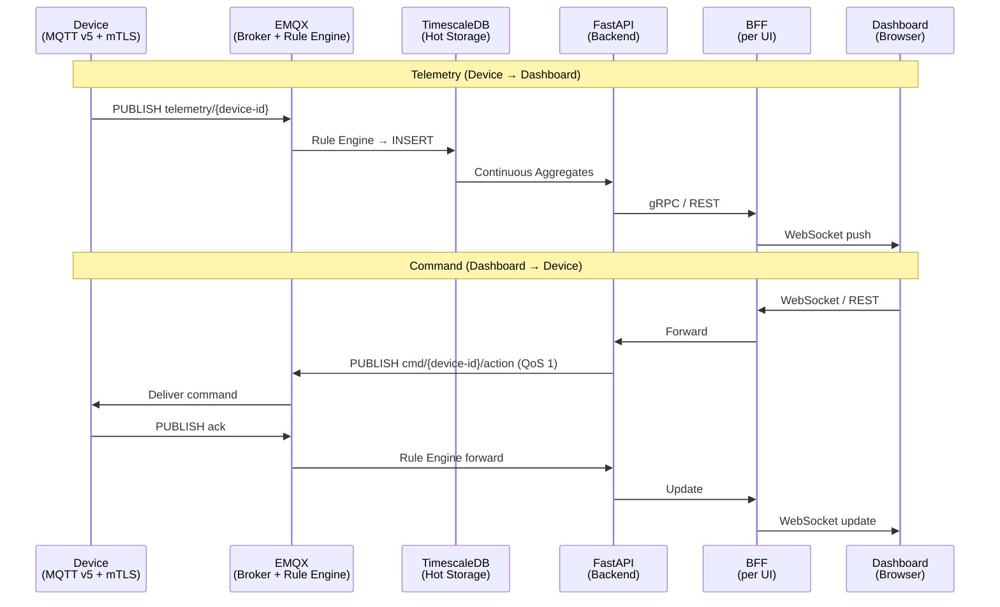
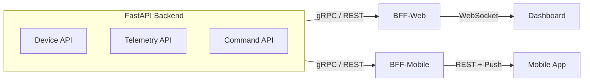
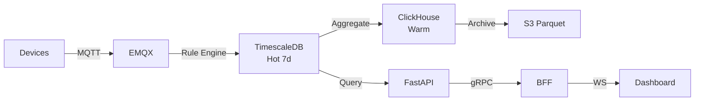



> **English Abstract** — Part 1 of 3. Core architecture for 1M IoT devices: **EMQX** (Rule Engine direct write) → **TimescaleDB** (hot 7d + Continuous Aggregates) → **FastAPI** → **BFF** → Dashboard. Includes protocol selection, broker comparison, three-tier storage, BFF design, cost estimation (~$17-33K/month), and AWS/GCP mapping. Scale-out (>1M): add Redpanda + ClickHouse.

## 前言

1 百萬台設備、每 10 秒回報一次 = **100K writes/sec**、**~1.7 TB/day**。

本系列採用**漸進式架構** — Phase 1 只需 4 個核心組件即可上線：

| Phase | 組件 | 適用規模 |
|---|---|---|
| **1 (MVP)** | EMQX + TimescaleDB + FastAPI + BFF | < 100 萬 |
| 2 | + ClickHouse + S3（冷熱分層） | 同上 |
| 3 | + Multi-tenant + DR | 同上 |
| 4 | + Redpanda + FastStream（event streaming） | > 100 萬 |

> **系列文章：** Part 1 核心架構（本篇）| [Part 2 安全與多租戶](/blog/2026/iot-1m-device-architecture-part2/) | [Part 3 運維與可靠性](/blog/2026/iot-1m-device-architecture-part3/)

---

## 架構資料流



EMQX Rule Engine 直寫 TimescaleDB，無 Event Streaming 中間層。延遲 <50ms，適合 1M 以下。>1M 需 dedup / event replay 時再加 Redpanda。

---

## 通訊協定與 Broker

| 協定 | 雙向 | 功耗 | Overhead | 適用 |
|---|---|---|---|---|
| **MQTT v5** | Yes | 極低 | 2-byte header | **IoT 預設** |
| CoAP | 有限 | 極低 | UDP | NB-IoT 受限設備 |
| gRPC | Yes | 高 | HTTP/2 + protobuf | Service-to-service |

MQTT v5 關鍵功能：Correlation ID、Shared subscriptions、Message expiry、Retained messages、LWT。

| Broker | 1M 連線 | Clustering | 推薦 | 說明 |
|---|---|---|---|---|
| **EMQX** | ✓ (100M+) | RAFT | ★★★★★ | 開源、Rule Engine 內建、社群最大 |
| HiveMQ | ✓ | 原生 | ★★★★ | 商業授權、企業支援佳 |
| Mosquitto | x (~100K) | 無 | 僅 dev | 單線程、無 clustering |

| 部署 | AWS | GCP | 月費 |
|---|---|---|---|
| **EMQX Cloud** | AWS | GCP | ~$8-15K |
| Self-hosted K8s | EKS | GKE | ~$3-8K + ops |

---

## Python 後端：asyncio

Free Threading (PEP 703) 預計 Python 3.16 (~2028) 才正式。1M 連線是 I/O-bound，asyncio + **uvloop** (2-4x 提升) + 多 worker 進程是正解。

```
HAProxy → Uvicorn worker 1..N (asyncio + uvloop, ~50-100K conn/worker)
           └── Redis/NATS cross-process pub/sub
```

---

## BFF (Backend for Frontend)

Backend 不直接面對前端 UI。BFF 層負責 WebSocket、API 聚合、Response 裁切。



| 層 | 職責 | 不做 |
|---|---|---|
| **Backend** | Device CRUD、Telemetry、Command、RBAC、MQTT | UI 邏輯 |
| **BFF** | WS 管理、聚合查詢、裁切、i18n | 直連 DB/MQTT |

| 面向 | 選擇 | 說明 |
|---|---|---|
| 語言 | FastAPI 或 Next.js API Routes | 依前端團隊技術棧 |
| BFF → Backend | gRPC 或 REST | gRPC 效能好，REST 開發快 |
| 快取 | Redis | Status cache + WS pub/sub |

---

## EMQX Rule Engine 資料寫入

不使用獨立 Event Streaming。Rule Engine 內建 PostgreSQL connector 直寫 TimescaleDB：
- SQL-like 過濾：`SELECT * FROM "telemetry/#" WHERE payload.temperature > 50`
- 訊息轉發、格式轉換、基本 dedup、Rate Limiting + 背壓

>1M 設備需 event replay / 多消費者時，加入 Redpanda（Phase 4）。

---

## 三層儲存策略

| 層 | DB | 保留 | 查詢延遲 | 月成本/TB | 說明 |
|---|---|---|---|---|---|
| **Hot** | TimescaleDB | 7 days | <10ms | ~$200 | 原始解析度，Dashboard 即時查詢 |
| **Warm** | ClickHouse | 30-90d | 50-500ms | ~$50 | 1min/5min 聚合，分析查詢 |
| **Cold** | S3 + Parquet | 年 | 秒級 | ~$2-5 | 時/日聚合，DuckDB ad-hoc |

**Continuous Aggregates** 是 Dashboard 查詢的關鍵 — 自動預聚合 1min/5min/1hr，查詢量降 600x。

```sql
CREATE MATERIALIZED VIEW sensor_1min
WITH (timescaledb.continuous) AS
SELECT time_bucket('1 minute', time) AS bucket, device_id,
       avg(temperature) AS avg_temp, max(temperature) AS max_temp
FROM telemetry GROUP BY bucket, device_id;
```



---

## 成本估算

| 組件 | AWS 月費 | GCP 月費 |
|---|---|---|
| EMQX Cloud (3 node) | ~$8-15K | ~$8-15K |
| TimescaleDB | ~$3-5K | ~$3-5K |
| ClickHouse Cloud | ~$2-4K | ~$2-4K |
| S3/GCS (~50 TB) | ~$1-2K | ~$1-2K |
| K8s (Backend+BFF) | ~$2-4K | ~$2-4K |
| Observability | ~$1-3K | ~$1-3K |
| **合計** | **~$17-33K** | **~$17-33K** |
| + Redpanda (>1M) | +$5-10K | +$5-10K |

| 規模 | 架構 | 月費 |
|---|---|---|
| < 10 萬 | EMQX + TimescaleDB + FastAPI + BFF | ~$3-8K |
| 10-100 萬 | + ClickHouse + S3 | ~$10-20K |
| > 100 萬 | + Redpanda + FastStream + DR | ~$30-60K |

---

## 技術選型總表

| 層 | 選擇 | AWS | GCP |
|---|---|---|---|
| 設備協定 | **MQTT v5** | — | — |
| Broker | **EMQX** | EMQX Cloud | EMQX Cloud |
| Data Ingestion | **Rule Engine** | — | — |
| Streaming (>1M) | **Redpanda** | MSK | Redpanda Cloud |
| Backend | **FastAPI + asyncio** | Fargate | Cloud Run |
| BFF | **FastAPI / Next.js** | Fargate | Cloud Run |
| UI 推送 | **WebSocket via BFF** | ALB | Cloud LB |
| Hot DB | **TimescaleDB** | Timescale Cloud | Timescale Cloud |
| Warm DB | **ClickHouse** | ClickHouse Cloud | ClickHouse Cloud |
| Cold | **S3 + Parquet** | S3 | GCS |
| Observability | **OTel + Grafana** | CloudWatch | Cloud Monitoring |

---

## 下一篇

- [Part 2：安全與多租戶](/blog/2026/iot-1m-device-architecture-part2/) — mTLS、Cert Rotation、RBAC、Topic ACL、DB 隔離
- [Part 3：運維與可靠性](/blog/2026/iot-1m-device-architecture-part3/) — Rate Limiting、Edge Resilience、DR、Observability、團隊風險

### 相關資源

- [EMQX Documentation](https://docs.emqx.com/) — MQTT Broker + Rule Engine
- [TimescaleDB Documentation](https://docs.timescale.com/) — Time-Series DB + Continuous Aggregates
