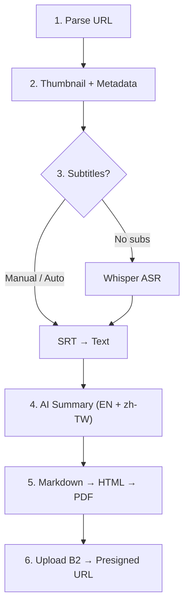
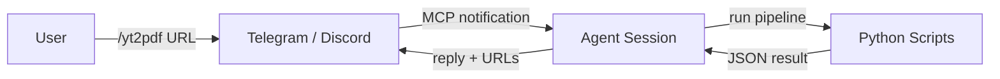



> **English Abstract** — This post dissects `/yt2pdf`, a 6-stage automation pipeline that converts any YouTube video into bilingual (EN + Traditional Chinese) PDF summaries. The pipeline chains yt-dlp subtitle extraction with Whisper ASR fallback, AI-powered bilingual summarization, headless Chrome PDF rendering with base64-embedded images, and Backblaze B2 cloud upload with 7-day presigned URLs. We examine the transcript fallback strategy, the orchestrator pattern, and 6 key design decisions for production deployment.

## 前言

在[之前的 Channel Plugin 實戰]()中，我們建立了 Telegram / Discord 雙向溝通的基礎設施。使用者開始在頻道裡丟 YouTube 連結，問「這個影片在講什麼？」——但每次都要手動看完影片、整理摘要、再回覆，效率太低。

`/yt2pdf` 就是為了解決這個問題：**一個指令，自動擷取字幕、產生雙語摘要、輸出 PDF、上傳雲端**。使用者在 Telegram 輸入 `/yt2pdf https://youtube.com/watch?v=xxx`，幾分鐘後就收到一份排版精美的 PDF 下載連結。

這是 [claude-code-channels](https://github.com/osisdie/claude-code-channels) v1.1.0 的核心功能。本文拆解它的完整 Pipeline 架構。

---

## Pipeline 架構總覽

整個流程分為 6 個階段，每個階段由獨立的 Python 模組負責：



簡化流程圖：



頻道整合的角度看，流程更簡單：



每個 Python 模組職責清楚：

| 模組 | 職責 | 輸入 | 輸出 | 說明 |
|------|------|------|------|------|
| `get_transcript.py` | 字幕擷取 + Whisper Fallback | Video ID | Plain text | 三層 Fallback確保有字幕 |
| `build_html.py` | Markdown → 排版 HTML | `.md` file | `.html` file | Base64 圖片嵌入 |
| `build_pdf.py` | HTML → PDF | `.html` file | `.pdf` file | Headless Chrome 渲染 |
| `upload_b2.py` | 上傳 B2 + 產生連結 | `.pdf` file | Presigned URL | 7 天限時下載 |
| `yt2pdf.py` | 串接以上四步 | `.md` files | JSON array | 一次性 B2 授權 |

---

## 字幕擷取的三層 Fallback策略

字幕擷取是整個 Pipeline 最不確定的環節——不是每支影片都有字幕。`get_transcript.py` 實作了三層 Fallback：

| 方法 | 來源 | 工具 | 延遲 | 準確度 | 適用場景 |
|------|------|------|------|--------|---------|
| Manual subtitles | 人工上傳字幕 | yt-dlp `--write-subs` | ~2s | 最高 | 有人工字幕的影片 |
| Auto-generated | YouTube 自動產生 | yt-dlp `--write-auto-subs` | ~2s | 中等 | 英語影片、熱門語言 |
| Whisper ASR | 音訊轉文字 | ffmpeg + HuggingFace API | 30-120s | 高 | 無字幕的影片 |

核心邏輯：

```python
def get_transcript(video_id: str) -> str | None:
    video_url = f"https://www.youtube.com/watch?v={video_id}"

    with tempfile.TemporaryDirectory(prefix="yt_transcript_") as tmpdir:
        tmp = Path(tmpdir)

        # Layer 1 & 2: Try subtitles (manual → auto-generated)
        srt = download_subtitles(video_url, tmp, lang="en")
        if srt:
            text = srt_to_text(srt)
            if len(text) > 100:
                return text

        # Layer 3: Whisper fallback
        text = whisper_transcribe_hf(video_url, tmp)
        if text and len(text) > 100:
            return text

    return None
```

> **Production Notes** — Whisper Fallback會增加 30-120 秒延遲（取決於影片長度），而且 HuggingFace Inference API 有 rate limit。建議在頻道回覆中先發 "Processing..." 訊息，讓使用者知道系統正在處理。SRT 解析會自動去除時間戳和序號，只保留純文字。

---

## Markdown → PDF：3 步轉換

拿到字幕後，AI 產生雙語 Markdown 摘要。接下來要把 `.md` 轉成可下載的 PDF。orchestrator `yt2pdf.py` 串接這三步：

```python
def process_one(md_path, title, upload, b2_prefix, b2_authorized):
    lang = _detect_lang(md_path)  # *_en.md → "en", *_zh-tw.md → "zh-tw"
    result = {"lang": lang, "md": str(md_path)}

    # Step 1: Markdown → styled HTML (base64 embedded images)
    html_content = build_html(md_path, title=title, lang=lang)
    html_path = md_path.with_suffix(".html")
    html_path.write_text(html_content, encoding="utf-8")

    # Step 2: HTML → PDF via headless Chrome
    pdf_path = md_path.with_suffix(".pdf")
    pdf_result = html_to_pdf(html_path, pdf_path)

    # Step 3: Upload to B2 (optional)
    if upload and pdf_result and b2_authorized:
        b2_path = f"{b2_prefix}/{pdf_path.name}"
        url = upload_file(pdf_result, b2_path)
        result["url"] = url

    return result
```

三步的關鍵設計：

**Base64 圖片嵌入** — `build_html.py` 會把本地圖片（如 `thumb.jpg`）轉為 data URI 嵌入 HTML。這讓 PDF 完全自包含，離線也能正常顯示。

**CJK 字型支援** — HTML 模板指定 `"Noto Sans TC", "Microsoft JhengHei", "PingFang TC"` 字型堆疊，確保繁體中文在各平台都能正確渲染。CSS 使用 `@page { size: A4; margin: 2cm; }` 控制頁面尺寸。

**Headless Chrome** — `build_pdf.py` 用 `google-chrome --headless --print-to-pdf` 產生 PDF。Chrome 的 CSS 引擎是所有 PDF 方案中 CJK 支援最完整的。

> **Production Notes** — Docker 環境需要 `--no-sandbox` 旗標和 `fonts-noto-cjk` 套件。`build_pdf.py` 會自動搜尋 `google-chrome`、`google-chrome-stable`、`chromium` 等執行檔路徑。

---

## B2 上傳與 Presigned URL

PDF 產生後，上傳到 Backblaze B2 雲端儲存並產生 presigned URL：

- **一次性授權** — orchestrator 在啟動時呼叫 `authorize_b2()` 一次，所有檔案共用同一個 session
- **日期分區路徑** — `yt2pdf/2026-04-04/summary_en.pdf`，方便按日期清理
- **7 天 TTL** — `b2 get-download-url-with-auth --duration 604800` 產生限時下載連結
- **降級策略** — B2 上傳失敗時，直接在頻道附加 PDF 檔案作為 fallback

為什麼用 presigned URL 而不是直接附件？Telegram Bot API 傳送檔案時會拆成**獨立訊息**——如果同時傳 EN + zh-TW 兩個 PDF，使用者會收到 3 條訊息（文字 + 2 個檔案），體驗很差。用 URL 可以把所有資訊整合在一條回覆中。

---

## Command Spec 驅動的 Agent 協作

整個 Pipeline 的入口不是 Python，而是一份 **Command Spec**：`.claude/commands/yt2pdf.md`。

這份 197 行的 Markdown 文件定義了 6 個步驟的完整流程——從 URL 解析、thumbnail 下載、metadata 擷取、transcript 提取、summary 生成到 PDF 輸出。它本質上是一個**結構化的 prompt**，告訴 Agent 怎麼協調各個 Python script。

```
Step 1: Parse & Acknowledge    → 解析 URL，回覆 "Processing..."
Step 2: Download Thumbnail     → curl YouTube CDN
Step 3: Fetch Metadata         → yt-dlp --dump-json
Step 4: Generate Summary       → AI 產生雙語 Markdown
Step 5: Build PDFs & Upload    → python3 scripts/yt/yt2pdf.py ...
Step 6: Reply with Results     → 格式化回覆 + presigned URLs
```

這跟[前幾天拆解的 Agent 架構]()中的 **Command System** 是同一個模式——用結構化文件定義工作流程，讓 Agent 按步驟執行。差別在於這裡的 Command Spec 不只定義步驟，還包含**錯誤處理策略**和**頻道特定的回覆格式**（Telegram vs Discord vs Slack）。

---

## 設計決策總覽

| 決策 | 選擇 | 替代方案 | 理由 |
|------|------|---------|------|
| 圖片嵌入 | Base64 data URI | 外部圖片連結 | PDF 自包含，離線可讀，轉寄不會破圖 |
| PDF 引擎 | headless Chrome | wkhtmltopdf / WeasyPrint | CJK 字型支援最佳，CSS 渲染最完整 |
| 檔案交付 | Presigned URL (7 天) | 直接附件 | 避免 Telegram 拆成多條訊息 |
| Pipeline 輸出 | JSON stdout | 檔案寫入 / exit code | 機器可解析，Agent 直接讀取結果 |
| 語言偵測 | 檔名慣例 (`*_en.md`) | 內容偵測 / 明確參數 | 簡單可靠，零外部依賴 |
| 目錄結構 | `YYYY-MM-DD/VIDEO_ID/` | 平面目錄 | 按日期清理、避免 ID 衝突 |

> **Production Notes** — B2 credential 建議使用 Application Key（非 Master Key），且限定單一 bucket 的權限。HuggingFace token 要注意 rate limit——免費方案的 Whisper large-v3 模型每小時有請求上限。

---

## 相關連結

- **Channel Plugin 實戰** — [從零開始建立 Telegram / Discord 雙向頻道]()
- **Agent 架構拆解** — [8 個可複用的 Production 設計模式]()
- **Agent Swarm 框架比較** — [5 大本地 Agent Swarm 框架全解析]()
