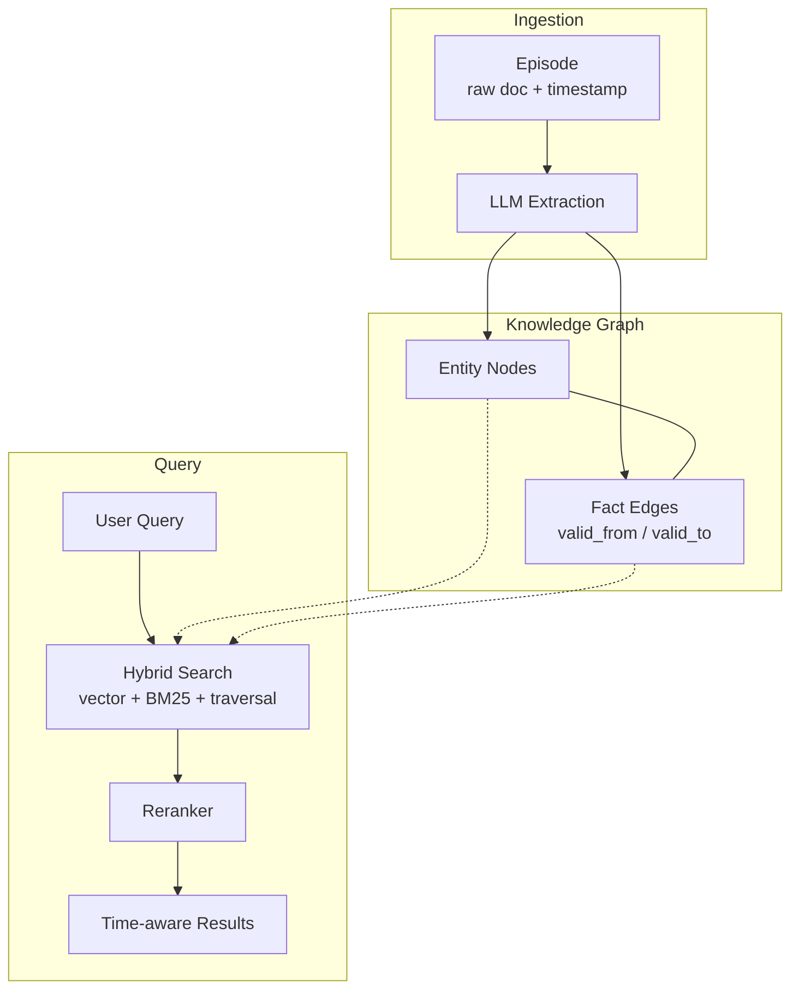



> **English Abstract** — When building long-term RAG infrastructure, the choice of GraphRAG framework determines how painful future migrations will be — changing embedding models, chunking strategies, or adding temporal awareness. This article compares three leading approaches — Graphiti (getzep/graphiti), Neo4j GraphRAG, and Temporal GraphRAG (T-GRAG) — across 9 critical dimensions. Based on 2026 Q2 production evaluations, Graphiti emerges as the top recommendation for teams prioritizing zero-migration-pain temporal knowledge graphs with hybrid search.

在[前一篇 RAG 挑戰與突破]()中，我們探討了 Graph RAG 作為突破傳統向量 RAG 多跳推理限制的關鍵方案。但「知道需要 GraphRAG」和「選對 GraphRAG 框架」是兩回事 — 尤其當你在意的是**長期可維護性**：embedding model 要換、chunking 策略要調、temporal 資料要追蹤，這些變更的遷移成本才是真正的痛點。

本文從 9 個維度深度比較三大 GraphRAG 方案，給出基於 2026 年 4 月最新實測的選型建議。

---

## 為什麼需要 GraphRAG？

傳統 vector-only RAG 把文件切成 chunks 再做 embedding 搜尋，**本質上丟失了實體之間的關係**。當問題需要跨文件推理（A 公司的 CEO → 該 CEO 參與的專案 → 專案的技術棧），flat chunks 根本無法串連這些跳轉。

GraphRAG 用**知識圖譜**（Knowledge Graph）儲存實體（Entity）與關係（Fact），讓 retriever 能沿著圖結構做 multi-hop traversal。但不同框架在 temporal 處理、migration 成本、生產就緒度上差異巨大。

對於「長期 RAG 基底」，框架必須能**存活過 model/strategy 的多次變更** — 這正是本文的選型核心。

---

## 三大框架簡介

### Graphiti（getzep/graphiti）

Zep 開源的 temporal knowledge graph 引擎，專為 **agent long-term memory** 設計。以 Episode（原始文件/對話）為 ingestion 單位，自動提取 Entity 與 Fact，每個 Fact 帶有 `valid_from` / `valid_to` 時間窗。支援 Neo4j、FalkorDB、Kuzu、Neptune 等多種 graph DB 後端。GitHub 24.8k stars，2026 年 4 月仍持續活躍。

### Neo4j GraphRAG

企業級 Graph DB 搭配官方 `neo4j-graphrag-python` 套件。生態最成熟（LangChain / LlamaIndex 原生支援），`HybridCypherRetriever` 提供 vector + full-text + Cypher traversal 三合一搜尋。但 temporal 需自建，embedding 變更成本高。

### T-GRAG（Temporal GraphRAG）

研究型概念框架，核心創新是**三層 temporal retriever**（temporal KG generator + temporal query decomposition + time-aware ranking）。概念上最貼合 temporal 需求，但多為論文實作（nano-graphrag 衍生），缺乏生產級 SDK。

---

## 九維度快速比較表

| 維度 | Graphiti | Neo4j GraphRAG | T-GRAG |
| ------ | ---------- | ---------------- | -------- |
| Temporal 感知 | **最強** | 良好但手動 | 強 |
| Embedding 換模 | **最佳** | 差 | 中 |
| Chunking 彈性 | **極佳** | 極佳 | 彈性 |
| Hybrid Search | **原生最佳** | 優秀 | 良好 |
| Schema 遷移成本 | **最低** | 中 | 中高 |
| 長期可維護性 | **最推薦** | 穩定 | 概念強 |
| 開箱即用度 | 高 | 中 | 低 |
| 後端依賴 | 多選（可切換） | Neo4j | 自選 |
| 社群活躍度 | 24.8k stars | 企業級穩定 | 研究型 |

**各維度說明：**

1. **Temporal 感知** — Graphiti：bi-temporal + fact validity window + 自動 invalidation；Neo4j：date property + Cypher 過濾，無原生 bi-temporal；T-GRAG：時間戳 + temporal query decomposition + 三層 retriever
2. **Embedding 換模** — Graphiti：換 `EmbedderClient` 即可，無需 re-ingestion；Neo4j：vector index 綁定 model，需 full re-embed + re-index；T-GRAG：視實作而定，常需 re-embed 整張圖
3. **Chunking 彈性** — Graphiti：Episode 為單位，per-fact 粒度，支援 late chunking；Neo4j：完全自訂，搭配任意 pipeline；T-GRAG：可自訂 upstream chunking
4. **Hybrid Search** — Graphiti：vector + BM25 + graph traversal + reranker，sub-200ms；Neo4j：HybridCypherRetriever 三合一；T-GRAG：可加 full-text
5. **Schema 遷移** — Graphiti：incremental update + pluggable backend；Neo4j：Cypher script，但 embedding 變更仍痛；T-GRAG：視自建程度
6. **開箱即用** — Graphiti：Python SDK + REST API + MCP server；Neo4j：需寫大量 Cypher + integration；T-GRAG：多為論文實作
7. **後端依賴** — Graphiti：Neo4j / FalkorDB / Kuzu / Neptune（可切換）；Neo4j：綁定 Neo4j；T-GRAG：自選 DB

---

## 深入分析

### Graphiti — 長期記憶與低遷移成本

Graphiti 的設計哲學是**最小化遷移成本**，對需要頻繁調整 embedding model 或 chunking 策略的團隊特別有利：

- **Temporal 是核心而非附加功能**：每個 Fact（edge）都有 validity window（`valid_from` / `valid_to`），舊 fact 只被 **invalidation** 而非刪除，保留完整歷史。支援 bi-temporal 追蹤（事件發生時間 + ingest 時間），可精準查「現在的 truth」或「2025 Q3 之前的版本」。
- **Embedding / Chunking 變更低成本**：embedding 只用在 node/fact 的 semantic search，換 model 只需換 `EmbedderClient`，不需要重跑 LLM extraction（詳見下節說明）。Chunking 以 Episode 為單位，可隨時改策略，新 episode incremental merge 不影響舊資料。
- **Hybrid Search 原生三合一**：vector + BM25（via OpenSearch/Lucene）+ graph traversal，搭配 RRF + cross-encoder rerank，latency sub-200ms。
- **Per-document Provenance**：每份文件/對話獨立提取 entity/fact，provenance 完整追蹤，支援 per-document metadata + temporal 標記。

> **Production Notes** — 預設跑在 Neo4j，若要完全無 DB 管理可考慮 Zep Cloud，但自管 Graphiti 更符合長期控制需求。FalkorDB 是輕量替代選項。

### Neo4j GraphRAG — 生態最成熟的企業級選擇

適合**已重度使用 Neo4j 生態**或需要最大掌控權的團隊：

- **生態最成熟**：LangChain / LlamaIndex 官方支援，`HybridCypherRetriever` 提供 vector index + full-text index + Cypher traversal 三合一，社群資源豐富。
- **完全掌控權**：Schema、index、query 全部用 Cypher 手動定義，最大彈性，適合有複雜 graph query 需求的場景。
- **需自建 temporal layer**：Temporal 需用 property 實作，無自動 invalidation。換 embedding model 需重建 vector index + full re-embed。
- **企業級穩定**：生產環境驗證多年，ACID 事務支援，適合對資料一致性要求高的場景。

> **Production Notes** — 如果你的 Neo4j 已經在跑，可以直接把 Graphiti 架在現有 Neo4j 上面（它就是設計來跑在 Neo4j 上的），兼得兩者優勢。

### T-GRAG — 最前沿的 Temporal 概念

概念上最深入 temporal 問題，適合對時間感知有嚴格需求的研究與 POC：

- **三層 temporal retriever**（temporal KG generator + temporal query decomposition + time-aware ranking）能有效解決「舊新知識混雜」的經典 RAG 問題，是目前學術界對 temporal RAG 最完整的理論框架。
- **高度靈活的 DB 後端**：不綁定特定 graph DB，可依需求自選。
- **生產就緒度較低**：多為論文實作（nano-graphrag 衍生或自建），缺乏成熟的 SDK + pluggable backend + 生產級 incremental update。
- **概念可移植**：T-GRAG 的 temporal 概念可以移植到 Graphiti 等生產框架上（兩者高度相容）。

> **Production Notes** — 適合做研究或 POC。若要投入生產，建議將 T-GRAG 概念整合到 Graphiti 或 Neo4j 上實現。

---

## Graphiti 核心架構



Graphiti 的資料流很直覺：**Episode（原始輸入）→ LLM 提取 Entity/Fact → 知識圖譜 → Hybrid Query**。關鍵在於每個 Fact edge 都攜帶時間窗，查詢時可指定「當前有效」或「特定時間點」的知識。

```python
# Graphiti: Episode ingestion with temporal awareness
from graphiti_core import Graphiti

graphiti = Graphiti(neo4j_driver, llm_client, embedder)

# 每個 Episode 帶時間戳，Graphiti 自動提取 Entity 與 Fact
await graphiti.add_episode(
    name="meeting-2026-04-12",
    episode_body="Kevin confirmed migration to text-embedding-3-large. "
                 "The old ada-002 index will be deprecated by Q3.",
    source_description="team standup notes",
    reference_time=datetime(2026, 4, 12),
)

# Facts 帶 valid_from / valid_to — 舊 fact 被 supersede 而非刪除
results = await graphiti.search("current embedding model")
# → Returns facts valid at current time, with full provenance chain
```

---

## 為什麼 Graphiti 換 Embedder 不需要 Re-ingest？

這是三者比較中最關鍵的架構差異，值得深入說明。

### 傳統 Vector RAG：Embedding IS the Data

```text
Raw Doc → Chunking → Embedding Model → Vector Index (= 唯一的資料表示)
```

在 vector-only RAG 中，embedding **就是**你的資料。換 model 意味著所有 chunks 的向量都失效 — 必須從頭 re-chunk + re-embed + re-index。

### Graphiti：Embedding 只是搜尋路徑之一

```text
Episode → LLM Extraction → Entity + Fact (= 主要資料，存在 Graph DB)
                                ↓
                          Embedder (= 附加搜尋索引)
```

關鍵差異在於 **ingestion 的重頭戲是 LLM extraction，不是 embedding**。Graphiti 用 LLM 從原始文本提取 Entity（節點）和 Fact（邊 + temporal metadata），這些結構化資料存在 graph DB 裡，**跟 embedding model 完全無關**。

Graphiti 的 hybrid search 有三條搜尋路徑：

| 搜尋路徑 | 依賴 Embedding？ | 換 Model 影響 |
| ---------- | :-: | -------- |
| Vector search | 是 | 需更新向量 |
| BM25 full-text | 否 | 完全不受影響 |
| Graph traversal | 否 | 完全不受影響 |

換 model 後，只有 vector search 路徑需要處理，**BM25 和 graph traversal 完全不中斷**。

### 實際操作成本比較

| 操作 | 傳統 Vector RAG | Graphiti |
| ------ | :-: | :-: |
| 換 Embedding model | Full re-ingest | 換 EmbedderClient 設定 |
| 舊資料處理 | 必須 full re-embed | Lazy re-embed 或 dual-index |
| 搜尋可用性 | 中斷至重建完成 | BM25 + traversal 不受影響 |
| LLM extraction 重跑 | N/A | **不需要（最貴的步驟）** |

精確地說，「no re-ingest」不等於「zero cost」— 舊資料的向量仍需要逐步更新。但最昂貴的步驟（LLM extraction）完全不受影響，加上兩條 non-embedding 搜尋路徑持續可用，這就是 Graphiti 在 embedding migration 上的核心優勢。

---

## 選型決策樹

每個框架有其最適場景，根據團隊現況選擇：

- **需要長期 agent memory + 動態知識 + 低遷移成本** → **Graphiti** 在 temporal 和 embedding migration 上有架構優勢。
- **已有 Neo4j 重度使用 + 需要最大掌控權** → 直接用 **Neo4j GraphRAG**，生態最成熟，或考慮在現有 Neo4j 上疊加 Graphiti。
- **Temporal 問題是核心研究方向** → **T-GRAG** 的三層 temporal retriever 是目前最完整的理論框架，適合 POC 與學術探索。
- **自建 vs 採用** — 三者都開源，但生產就緒度差異大。評估團隊的 graph 工程能力後再決定自建程度。

### 實務建議（避免未來 migration 地雷）

1. **永遠保留 raw episode/document** — Graphiti 已內建 provenance，確保任何時候都能從原始資料重建。
2. **Embedding pin 版本 + dual-index** — 新 model 建 shadow index，逐步切換，避免一次性 full re-embed。
3. **Chunking 用 semantic / proposition / late** — 而非固定 size，Graphiti 對此支援最好。
4. **時間窗查詢取代硬刪除** — 利用 bi-temporal 特性，保留完整歷史版本。

---

## 總結

三者各有定位：**Graphiti** 在 temporal 感知與 embedding migration 上有架構優勢，適合需要長期演進的 agent memory；**Neo4j GraphRAG** 生態最成熟、掌控力最強，適合企業級部署；**T-GRAG** 概念最前沿，適合研究與 POC。

沒有「唯一正解」— 最佳選擇取決於團隊的技術棧、graph 工程能力、以及對 temporal / migration 的實際需求。本文提供的九維度比較旨在幫助你根據自身場景做出 informed decision。

---

## References

- [Graphiti — getzep/graphiti](https://github.com/getzep/graphiti) — Temporal Knowledge Graph for Agent Memory
- [Neo4j GraphRAG Python](https://github.com/neo4j/neo4j-graphrag-python) — Official Neo4j GraphRAG Package
- [Microsoft GraphRAG](https://github.com/microsoft/graphrag) — Graph-based RAG (static, community summarization)
- [T-GRAG Paper](https://arxiv.org/abs/2410.06530) — Temporal Graph Retrieval-Augmented Generation
- [前一篇：LLM 整合 RAG 技術的核心挑戰與突破方向]()
