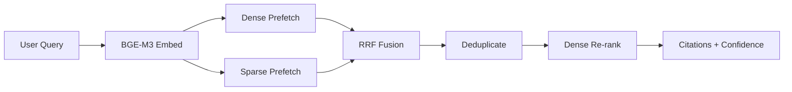



> **Abstract** — A practical guide to building a hybrid search RAG pipeline over FAQ data using BGE-M3 dense embeddings + sparse TF vectors, Qdrant named vectors, and RRF fusion. Covers query expansion for recall, dense cosine re-ranking for calibrated confidence, and Redis cache warming for latency — with real eval numbers from production.

---

## 前言

[前一篇 RAG 文章]()從挑戰與突破的角度談了 RAG 的四大方向。這篇是**實戰篇** — 紀錄將 hybrid search 落地到 FAQ 客服知識庫的完整過程，包含踩過的坑和從 eval 數據得到的 insight。

核心問題：純 vector search 會漏掉關鍵字精確匹配；純 BM25/keyword search 又抓不到語意相近的改寫。**Hybrid search 把兩者融合，是 FAQ 場景最務實的解法。**

---

## 為什麼 FAQ 需要 Hybrid Search？

FAQ 資料的特性：**短文本、高密度、精確匹配很重要**。

| 搜尋方式 | 優點 | 缺點 |
| --- | --- | --- |
| Dense (語意) | 抓到改寫、同義詞 | 漏掉精確關鍵字 |
| Sparse (關鍵字) | 精確匹配專有名詞 | 不懂語意相近 |
| **Hybrid** | **兩者兼顧** | 需要融合策略 |

舉例：使用者問「**怎麼改密碼**」，FAQ 裡的原始問題是「**重設密碼流程**」。

- Dense search 能靠語意抓到「改 ≈ 重設」的關聯
- Sparse search 能精確匹配「密碼」這個詞
- **Hybrid search 兩路都中，排名更高、信心更足**

---

## 系統架構總覽



關鍵元件：

| 元件 | 用途 |
| --- | --- |
| BGE-M3 | 1024 維 dense embedding + tokenizer sparse vector |
| Qdrant | 向量資料庫，支援 named vectors (dense + sparse) |
| RRF Fusion | Reciprocal Rank Fusion，合併兩路搜尋結果 |
| Redis | 快取 RAG 結果，啟動時 cache warming |

---

## Embedding 策略 — Dense + Sparse

### Dense: BGE-M3

[BGE-M3](https://huggingface.co/BAAI/bge-m3) 是目前最強的多語言 embedding model 之一，1024 維、支援中英文、cosine similarity。

**重點**：BGE-M3 使用 asymmetric retrieval — query 需要加 `"query: "` 前綴：

```python
from sentence_transformers import SentenceTransformer
from collections import Counter
from qdrant_client.models import SparseVector

model = SentenceTransformer("BAAI/bge-m3")

def embed_query(query: str):
    prefixed = f"query: {query}"

    # Dense embedding (1024d, normalized for cosine)
    dense = model.encode(prefixed, normalize_embeddings=True).tolist()

    # Sparse vector from tokenizer term frequencies
    tokens = model.tokenizer(prefixed, add_special_tokens=False)
    counts = Counter(tokens["input_ids"])
    indices = sorted(counts.keys())
    values = [float(counts[i]) for i in indices]
    sparse = SparseVector(indices=indices, values=values)

    return dense, sparse
```

### Sparse: Tokenizer Term Frequency

為什麼不用 BM25？因為 BM25 需要整個 corpus 的 IDF 統計，而 tokenizer TF 只需要 per-query 計算 — **更簡單、更快、且在 Qdrant named vectors 架構下無縫整合**。

---

## Qdrant Hybrid Search — Prefetch + RRF

Qdrant 的 `query_points` API 支援 **prefetch + fusion** 模式 — 先各自搜尋 dense 和 sparse，再用 RRF 合併：

```python
from qdrant_client.models import Prefetch, FusionQuery, Fusion

results = await qdrant.query_points(
    collection_name=collection,
    prefetch=[
        Prefetch(query=dense_vector, using="dense", limit=top_k * 3),
        Prefetch(query=sparse_vector, using="sparse", limit=top_k * 3),
    ],
    query=FusionQuery(fusion=Fusion.RRF),
    limit=top_k,
)
```

### RRF 公式

$$\text{score}(d) = \sum_{i} \frac{1}{k + \text{rank}_i(d)}$$

其中 $$k = 60$$（Qdrant 預設值）。RRF 是 rank-based 而非 score-based — **不需要對 dense 和 sparse 的分數做 normalization**，這是它比 weighted sum 更實用的原因。

---

## 信心分數與 Re-ranking — 最大的 Pitfall

> 這段是從真實 commit 歷史得到的教訓：一開始直接用 RRF fusion score 當 confidence，結果 threshold 一調就炸。經過多輪修正才釐清根本原因。

### 問題：RRF 分數不可解釋

RRF score 是 `1/(k + rank)` 的加總 — 它反映的是**排名位置**，不是語意相似度。0.5 不代表「50% 相似」，它可能只是「在 dense 排第 10、sparse 排第 20」的結果。

**拿 RRF score 設 confidence threshold 會很不穩定** — 加一筆資料、調一下 top_k，threshold 就失效了。

### 解法：RRF 生候選、Dense Cosine 打分數

```text
Step 1: RRF fusion → 產生候選 (candidate generation)
Step 2: Dense cosine similarity → 重新排序 + 校準信心分數
```

Dense cosine similarity **有可解釋性**：0.0 = 完全無關、1.0 = 完全一致。設定 threshold 0.6 代表「至少 60% 語意相似」，穩定且可預期。

```python
# RRF 候選已取得，改用 dense search 做 re-ranking
dense_hits = await qdrant.search(
    collection_name=col,
    query_vector=("dense", dense_vector),
    limit=top_k,
    score_threshold=0.0,
)

# confidence = 最高分的 dense cosine similarity
confidence = dense_hits[0].score if dense_hits else 0.0
has_answer = confidence >= 0.6  # calibrated threshold
```

**這是整個 pipeline 最重要的一課：不要把「擅長找候選」和「擅長打分數」混為一談。RRF 擅長前者，dense cosine 擅長後者。**

---

## Eval 驗證 — 數字會說話

完成 pipeline 後，跑一次結構化 eval 來驗證。測試集設計：

- **FAQ 原始問題**：知識庫裡的原文，應該 100% 命中
- **Paraphrase 改寫**：口語化/同義改寫，測試語意理解
- **Out-of-Scope (OOS)**：完全無關的問題，應該被拒絕
- **Edge Case**：邊界情境

### 結果

| 類型 | 命中率 | 平均 Confidence |
| --- | --- | --- |
| FAQ (原始問題) | 100% | 0.80 |
| Paraphrase (口語改寫) | 100% | 0.72 |
| Edge Case | 100% | 0.73 |
| Out-of-Scope | 0% (100% 拒絕) | 0.09 |

### 關鍵觀察

1. **Query Expansion + Hybrid Search 效果顯著** — FAQ 原文和改寫都 100% 命中
2. **OOS 拒絕乾淨** — confidence threshold 0.6 有效區隔，最接近 threshold 的 OOS query confidence 只有 0.53
3. **Paraphrase 信心偏低** — 平均 0.72 vs FAQ 原文 0.80，口語化問法（如「免費方案有什麼限制」）接近 threshold 邊緣（0.65）
4. **0.53–0.60 是危險區間** — 如果有 OOS 問題恰好與 FAQ domain 有部分詞彙重疊，可能穿透 threshold。需要定期補充 eval case 監控

---

## Query Expansion — 提升 Recall

FAQ 資料量通常很小（100–500 筆），**精確問題比對很脆弱**。

解法：用 LLM（例如 Gemini Flash）為每筆 FAQ 生成 3 個同義問法：

```text
原始: "如何重設密碼？"
→ 擴展 1: "忘記密碼要怎麼辦？"
→ 擴展 2: "我想改密碼，步驟是什麼？"
→ 擴展 3: "密碼忘了可以找回嗎？"
```

**效果**：100 筆原始 FAQ → 400 筆可搜尋的 entry，recall 大幅提升。

去重策略：所有擴展 entry 都記錄 `original_question`，搜尋結果按 `original_question` 分組，只保留最高分的那筆。

---

## 快取策略 — Redis Cache Warming

### Cache Key 設計

```text
rag_cache:{context}:{sha256(query)[:16]}
```

TTL 可設定（例如 1 小時）。用 SHA-256 前 16 碼做 key 避免長 query 的 Redis key 太大。

### Cache Warming

伺服器啟動時，對所有 context 的 suggested questions 預跑 RAG pipeline：

```python
async def warm_cache(qdrant, redis):
    for context in ALL_CONTEXTS:
        for question in SUGGESTED_QUESTIONS:
            await search(qdrant, question, context, redis=redis)
```

**效果**：使用者點擊 suggested question → 只需要 LLM 生成回答（embedding + Qdrant search 已快取），首次回應延遲從 ~3s 降到 ~1s。

---

## Multi-Collection Routing

FAQ 知識庫通常有**共用 FAQ + 租戶/情境專屬 FAQ** 的結構：

```python
CONTEXT_COLLECTIONS = {
    "team_a": ["faq_shared", "faq_team_a"],
    "team_b": ["faq_shared", "faq_team_b"],
}
```

搜尋時根據 context 決定搜哪幾個 collection，shared collection 永遠會被搜。

進階：collection routing 也可以從 DB 動態讀取（管理後台配置），再用 Redis 快取，避免每次 query 都查 DB。

---

## 總結

| 元件 | 功能 | 為什麼重要 |
| --- | --- | --- |
| Dense + Sparse | 語意 + 關鍵字雙路搜尋 | 單路必有盲點 |
| RRF Fusion | 合併雙路候選 | Rank-based，不需分數校準 |
| Dense Re-rank | 校準信心分數 | RRF 分數不可解釋，cosine 可以 |
| Query Expansion | 每筆 FAQ ×3 同義改寫 | 小資料集 recall 救星 |
| Cache Warming | 啟動時預熱常見問題 | 首次回應 3s → 1s |

**最大教訓**：不要把 RRF fusion score 當 confidence — 它是 rank-based 的，不像 dense cosine similarity 有 0~1 的可解釋性。用 RRF 找候選，用 dense cosine 打分數。

延伸閱讀：[GraphRAG 框架深度比較]() — 如果你需要更進階的 graph-based retrieval。

---

## References

1. [BGE-M3 — BAAI](https://huggingface.co/BAAI/bge-m3) — Multi-lingual, multi-granularity embedding model
2. [Qdrant Hybrid Search](https://qdrant.tech/documentation/concepts/hybrid-queries/) — Prefetch + Fusion API
3. [Reciprocal Rank Fusion (RRF)](https://plg.uwaterloo.ca/~gvcormac/cormacksigir09-rrf.pdf) — Cormack et al., SIGIR 2009
4. [前一篇：RAG 挑戰與突破]()
