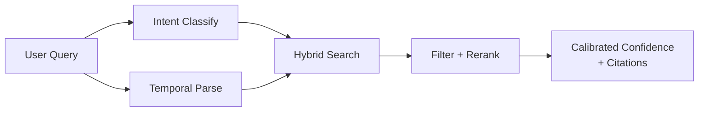



> **Abstract** — A complete production-ready RAG architecture covering three pillars that basic hybrid search alone doesn't solve: (1) pre-search intent classification for routing and short-circuiting, (2) three-layer temporal-aware retrieval (embedding query cleaning + Qdrant date filter + exponential-decay recency rerank with soft fallback), and (3) eval-driven confidence calibration to replace guessed thresholds. Includes concrete recency weight tables, final-score formula, pattern-priority rules, and a per-intent eval checklist.

---

## 前言

[前一篇 FAQ Hybrid Search RAG]() 談的是 RAG pipeline 的骨架 — dense + sparse 雙路、RRF fusion、dense cosine 校準 confidence。那是「搭起來」的部分。

這篇講 production 上**還缺哪幾層**。當知識庫包含時序資料（release notes、incident log、版本更新）、又要接多種 intent（FAQ 問答、changelog 查詢、閒聊、轉人工），只靠 hybrid search 會碰到三個現象：

1. **時序敏感 query 被舊資料污染**：「最近的 release」會被 dense embedding 拉到去年某篇標題含「最近一波更新」的舊 entry
2. **路由混亂**：`chitchat` 和 `handoff` 類 query 也走完整 retrieval，浪費 latency 又容易撈到錯東西
3. **Confidence threshold 無從驗證**：`0.6` 是直覺設定的值，沒有數據背書

本帖提出的解法是把 RAG pipeline 拆成三層：**Intent Routing → Temporal-Aware Retrieval → Calibrated Confidence**，並在最後把 magic number 用 eval infrastructure 收束回可驗證的範圍。

---

## 整體架構



> Intent Classify 與 Temporal Parse 可並行執行（兩者無相依）；Intent 提供 collection boost、Temporal 提供 cleaned query 與 date range，共同進入 Hybrid Search。Filter + Rerank 使用 date range 做 hard filter 與 recency decay；Intent boost 在最後 score 聚合時乘入。

三層對應三個責任：

| 層 | 責任 | 輸出 |
| --- | --- | --- |
| **Layer 1 — Intent Routing** | 分類 query 類型、決定是否走 retrieval、決定 boost | `intent_category` + `intent_boost` + (可選) date hint |
| **Layer 2 — Temporal-Aware Retrieval** | Cleaning → Date Filter → Recency Rerank | 候選 citations + recency-adjusted score |
| **Layer 3 — Calibrated Confidence** | 把 score 轉成可解釋的 confidence + threshold 決定 handoff | `confidence` + `has_answer` |

---

## Layer 1：Pre-RAG Intent Classification

### 為什麼要在 retrieval 之前分類

不是所有 query 都該走同一條 pipeline：

- `chitchat`（「你好」、「謝謝」）走 retrieval 等於浪費 100ms + 可能 hit 到無關 entry
- `handoff`（「轉客服」、「我要投訴」）應該 short-circuit 到人工路由，不該被當 retrieval miss
- `changelog`（「最新版本支援 SSO 嗎」）應該 boost changelog collection；`faq`（「忘記密碼」）應該 boost FAQ collection — hybrid search 自己分辨不出來

### 實作：Fast LLM Classifier

用快速 model（e.g. Gemini Flash Lite 或 GPT-4o-mini），單次 call 同時回傳 category 與 optional temporal hint：

```python
class IntentResult(BaseModel):
    category: Literal["faq", "changelog", "status", "chitchat", "handoff"]
    temporal: bool = False  # 是否含時間敏感訊號
    date_hint: Optional[str] = None  # 可選的推測日期範圍

async def classify_intent(query: str) -> IntentResult:
    try:
        return await llm.parse(
            model="flash-lite",
            prompt=INTENT_PROMPT.format(query=query),
            response_model=IntentResult,
            timeout=5.0,
        )
    except (TimeoutError, Exception):
        return IntentResult(category="faq")  # 安全預設
```

### Intent Categories 與行為對照

| Intent | 行為 | Collection Boost |
| --- | --- | --- |
| `faq` | 走 RAG，搜 FAQ collection | — |
| `changelog` | 走 RAG + temporal layer 全開 | × 1.3 changelog |
| `status` | 走 RAG + 短 TTL fresh data | × 1.2 status |
| `chitchat` | Short-circuit，LLM 直接回應 | N/A |
| `handoff` | Short-circuit，路由到人工 | N/A |

### Final Score 公式

```text
final_score = raw_dense_cosine × recency_boost × intent_boost
```

- `raw_dense_cosine`：0~1 可解釋的 cosine similarity（詳見前一篇 hybrid search 討論）
- `recency_boost`：來自 Layer 2 的 L3，範圍 `[1 − w/2, 1 + w/2]`
- `intent_boost`：僅當 intent 對應 collection 時套用，例如 `changelog` intent + changelog collection → × 1.3

### Timeout 與 Fallback

Intent classifier 失敗（timeout、model error）→ fallback 到 `faq` intent，**絕對不能讓 intent 掛斷整條 RAG pipeline**。

> 💡 **設計考量 — Library 與 caller 的責任邊界**
>
> Query cleaning 與 enrichment（例如加上 tenant / 產品名稱至 embedding query）應由 caller 控制，library 內 `rag.search()` 不要隱式覆寫 caller 傳進來的 `query`。建議 API 形如 `search(query, embed_query_override=None, temporal_hint=None)` — caller 可以自由疊加 enrichment 與 cleaning，不會被 library 以 `temporal_hint.cleaned_query` 偷換掉。RAG pipeline 可調參數多，library 任何隱含副作用都會大幅提高 debug 難度。

---

## Layer 2：Temporal-Aware Retrieval（三層防線）

當知識庫含有時序資料，「最近 X」「下個月的 Y」「5月的 Z」這類 query 不能只靠 dense+sparse。dense embedding 會把「最近」這個詞在 latent space 中對齊到「最新 / 近期 / 上次」這些語意相近的 token，結果 top-1 可能是一年前的某篇標題含「最近一波更新」的舊文章。

解法是**三層獨立但互補的機制**：

### L1 — Embedding Query Cleaning

以 regex 把 query 中的時間詞 strip 掉，再送去 embed。「最近的 release」→ embed 「release」，避免 semantic match 到含「最近」「最新」的舊 entries。

### L2 — Date Filter

以 Qdrant payload `date` keyword index 做範圍過濾（例如：只取最近 14 天的 entries）。與 Layer 1 的 cleaning 互補 — cleaning 只能讓 embedding 不被時間詞帶偏，但沒有 hard 排除舊資料。

```python
date_filter = Filter(
    must=[FieldCondition(
        key="date",
        range=DateRange(gte=datetime.now() - timedelta(days=14)),
    )]
)
results = await qdrant.query_points(
    collection_name=col,
    prefetch=[...],
    query=FusionQuery(fusion=Fusion.RRF),
    query_filter=date_filter,
    limit=top_k,
)
```

所有 collection 的 `date` 欄位需事先建 keyword index，否則 range filter 會 fallback 成 full scan。

### L3 — Recency Rerank（Exponential Decay）

即使在 filter 範圍內，還是該讓較新的 entries 分數更高。用指數衰減 boost，half-life 90 天：

```text
recency_boost(age_days) = exp(−ln(2) × age_days / half_life)
adjusted_score = raw_dense_cosine × [1 − w/2, 1 + w/2] of recency_boost
```

其中 `w`（recency weight）由原始時間詞決定 — 時間表達越具體、weight 越大。

### Recency Weight 對照表

| 時間表達 | 範圍 | Recency weight |
| --- | --- | --- |
| 上一次 / 最近一次 / 前一次 | 14 天 | 1.0 |
| 最近 | 30 天 | 0.8 |
| 今天 / 明天 / 昨天 | 單日 | 0.5 |
| 這週 / 上週 / 下週 | 7 天區間 | 0.6 |
| M月 / M月D日（無年份） | 當年該月/該日 | 0.3 |
| 今年 / 去年 | 全年 | 0.2 |
| （無時間詞） | 不過濾 | 0.3（微量 baseline） |

### Pattern Priority（First-Match-Wins）

時間 regex 的比對順序很重要，錯誤順序會導致「2026年5月」被匹配成「2026年 + 5月」兩次。建議順序：

```text
YYYY年M月D日  →  YYYY年M月  →  M月D日  →  M月
               →  相對時間（上週 / 下個月 / 昨天）
               →  年度（今年 / 去年）
```

同時使用 negative lookahead 避免誤抓 — 「今年」在 `今年的 release`（時間 token）和 `今年的規劃`（描述 token）語意不同，可以用類似 `今年(?!.{0,3}規劃|.{0,3}方向)` 的 pattern 排除非時間 context。

### Soft Fallback：漸進式擴大（Graceful Degradation）

Date filter 過濾完若 0 結果，**不要直接移除 filter** — 那會讓「上週的 incident」一瞬間退化成「全歷史的 incident」，可能回到兩年前的 entry 而 confidence 看起來還不低（因為語意完全相關）。正確做法是漸進式放寬：

```python
DATE_RANGES = [
    timedelta(days=7),    # 原始範圍
    timedelta(days=30),   # 第一次擴大
    timedelta(days=90),   # 第二次擴大
    None,                 # 最後才完全移除 filter
]

for date_range in DATE_RANGES:
    results = await search(query, date_filter=build_filter(date_range))
    if results:
        log.info(f"hit at fallback level {date_range}")
        return results

return []  # 沒有可信結果，誠實回 empty
```

**同時 log fallback level**，累積後可以看出：

- 哪些 query pattern 經常觸發 fallback → 補資料缺口
- 哪些 base 範圍（7 天 / 14 天）設得不合理 → 調整 default
- 是否有特定時段系統性 0 結果 → 預先準備 fallback 內容或直接導引到人工

> 💡 **設計考量 — Cleaned query 過短的 embedding 行為**
>
> Layer 2 L1 的 cleaning 會把「下個月的 release」縮成「release」。BGE-M3 是 contextual embedding — 少於 N tokens 的 query 缺乏 disambiguation 依據，生成的 vector 落在 latent space 中性區域，cosine similarity 會對所有候選都不高也不低。處理方式：
>
> 1. **Caller 端補 enrichment**：在 cleaned query 前後加產品名 / context 詞補足至 ≥ 20 字，例如 `"Acme Cloud release 變更內容"`
> 2. **Embedding layer 做 length gate**：低於 min tokens 直接回報 error，由 caller 決定要補 context 還是 abort
> 3. **自動 query expansion**：對短 query 用 LLM 生成 3 個擴寫變體，全部 embed 後 mean pool
>
> 量測 query length distribution 是 RAG pipeline 很早就應該加的 instrumentation — 短 query 比例過高，通常代表 cleaning 或 intent classifier 出了邊界問題。

---

## Layer 3：Calibrated Confidence

前一篇 post 已經討論過為什麼 **confidence 應該用 dense cosine re-scoring 而不是 RRF fusion score** — RRF 是 rank-based 的合併分數，不具有「0 = 完全無關、1 = 完全一致」的可解釋性；dense cosine 才能當 threshold。

但即使用了 dense cosine，threshold 設在 0.6 仍然是估計值：

- 為什麼 0.6 不是 0.55 或 0.65？
- 不同 intent category 該不該有不同 threshold？
- Paraphrase / 口語化 query 平均 confidence 較低，會不會系統性地被判 handoff？

這些問題沒有 eval infrastructure 就無法回答。下一節就是解法。

---

## Eval Infrastructure — 把 Magic Number 變成數據

Pipeline 各層在運行時會用到一組常數，其值來源目前多為「經驗估計」：

| 常數 | 目前值 | 需驗證的假設 |
| --- | --- | --- |
| `CONFIDENCE_THRESHOLD` | 0.6 | 降到 0.55 → handoff false positive 會減少多少？尚無數據 |
| `CITATION_MIN_SCORE` | 0.5 | 把 score 0.5 的 citation 送進 LLM 是否會誘發錯誤答案？尚無數據 |
| Intent boost 倍率 | × 1.3 | 1.2 / 1.3 / 1.5 之間的差異從未測量 |
| Recency half-life | 90 天 | 高頻發版期 vs 維護期是否應使用不同半衰期？尚未實驗 |
| Recency weight 分級 | 1.0 / 0.8 / 0.6 / 0.5 / 0.3 | 分級未經 user study 或 A/B 支撐 |
| `MIN_EMBED_LEN` | < 20 / < 8 字 | 20 是依直覺設定；15 或 25 效果如何無人知道 |
| Intent classifier timeout | 5s | 太長拖 latency、太短 fallback 頻繁 — 無量測依據 |

這些數值全部都**應該由數據決定**，而不是開發者的直覺。必要的 eval infrastructure：

| 項目 | 作用 |
| --- | --- |
| **Golden query set（≥ 50 筆，每個 intent ≥ 5 筆）** | 任何 threshold / boost 的調整都用它驗 regression |
| **Precision@3 / Recall@3** | 量化 top-3 citation 的相關性 |
| **Per-intent eval breakdown** | `faq` / `changelog` / `status` 的表現可能差異很大，整體 metric 會被平均掉 |
| **Temporal eval case set** | 專門針對時間詞的 query（「最近」「上個月」「5月的 X」），驗 Layer 2 不 regression |
| **Confidence calibration curve** | 在 golden set 上畫 precision-recall curve，找 F1 最大的 threshold |
| **A/B / Shadow eval** | Persona prompt、LLM model、boost 倍率變更都先 shadow run 比對 |

### 已知失敗模式（尚未完全修復）

以下模式在目前 pipeline 中仍會發生，列出做為 eval case set 的起點：

- **Cleaned query 過短**：需要 embedding layer 的 length gate 或自動 query expansion
- **無時間詞但意圖時間敏感**：如「近期發生問題的 service」— parser 抓不到具體日期，目前只靠 recency boost 軟性處理。理想做法是讓 intent classifier 回吐推測的日期範圍
- **Query normalization 不足**：繁簡混用（「下各月」）、中英混用（「ticket 怎麼開」）、typo → regex miss，走 fallback。需要 normalization layer（繁簡轉換 + alias）
- **Query expansion 生成品質未驗證**：擴寫的同義問法未經人工 sample 標註，質量未知
- **Persona system prompt 對 confidence 的影響**：改 prompt 會不會讓 LLM 對 borderline citation 變得更激進？尚無 A/B 數據

---

## 跨層 Debug — 5-Step 排查 Checklist

RAG pipeline 的一個症狀（confidence 低、citation 錯）往往對應多個 root cause — 可能是 Layer 1 的 intent miss，可能是 Layer 2 L1 的 cleaning 過度，也可能是 L2 date filter 範圍不對。**靠看 endpoint output 很難定位根因**，必須逐層 bypass 驗證：

| Step | 做什麼 | 看什麼 |
| --- | --- | --- |
| 1 | `parse_temporal_query("下個月")` 直接呼叫 | date range 是否符合預期 |
| 2 | `qdrant.scroll(collection, filter=date_filter)` | 該時段是否有實際資料 |
| 3 | `embed(cleaned_query)` 並對候選 entries 算 cosine | 確認短 query 沒有在 latent space 落在中性區域 |
| 4 | `rag.search(query, bypass_cache=True)` | 未經 cache 的 raw confidence |
| 5 | 比對 step 4 的結果與 actual endpoint 回應 | 差異來源於 cache 或後續層 |

每一層看到不同數字，代表該層有隱含副作用 — 定位到具體層後再修。

---

## 總結 — 完整 Pipeline Checklist

| 層 | 關鍵設計 | 為什麼 |
| --- | --- | --- |
| **Layer 1 — Intent Routing** | LLM classifier（fast model，~100ms），5s timeout + fallback 到 `faq` | chitchat / handoff 應 short-circuit；boost 應按 intent 條件套用 |
| **Layer 2 L1 — Query Cleaning** | Regex strip 時間詞再 embed | 避免 dense embedding semantic match 到舊時間詞 entries |
| **Layer 2 L2 — Date Filter** | Qdrant payload keyword index 範圍過濾 | Hard 排除過期資料，cleaning 做不到 |
| **Layer 2 L3 — Recency Rerank** | 指數衰減，half-life 90 天，weight 由時間詞決定 | 範圍內也要偏好較新 entries |
| **Soft Fallback** | 7 → 30 → 90 → off，分級擴大並 log level | 避免「0 結果」退化成「全歷史」 |
| **Layer 3 — Calibrated Confidence** | Dense cosine re-scoring（非 RRF score） | 0~1 可解釋的 threshold |
| **Eval Infrastructure** | Golden set + per-intent + temporal cases + calibration curve | 把 magic number 變成有數據背書的決策 |
| **Layered Debug** | 5-step bypass checklist | 跨層問題無法只從 endpoint output 診斷 |

延伸閱讀：[FAQ Hybrid Search RAG Pipeline 實戰]() — 同一個 pipeline 的 hybrid search 骨架；[RAG 挑戰與突破]() — 更廣的 RAG 全景。

---

## References

1. [Qdrant Hybrid Search](https://qdrant.tech/documentation/concepts/hybrid-queries/) — Named vectors + Prefetch + Fusion API
2. [Qdrant Filtering & Payload Index](https://qdrant.tech/documentation/concepts/filtering/) — Date range filter（Layer 2 L2）
3. [BGE-M3 — BAAI](https://huggingface.co/BAAI/bge-m3) — Multi-lingual embedding model used throughout
4. [Reciprocal Rank Fusion (RRF)](https://plg.uwaterloo.ca/~gvcormac/cormacksigir09-rrf.pdf) — Cormack et al., SIGIR 2009
5. [前一篇：FAQ Hybrid Search RAG]() — 搜尋端 dense + sparse + RRF + dense cosine confidence
6. [更前一篇：RAG 挑戰與突破]() — RAG 全景
