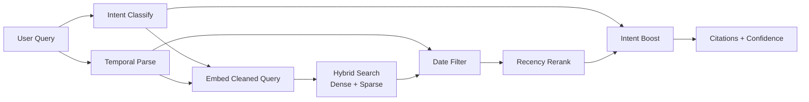



> **Abstract** — Six RAG-specific production lessons learned from debugging a single query path («下個月的 release 有什麼？») end-to-end. Covers caller/callee contract violations in `rag.search()`, three-layer temporal-aware retrieval (query cleaning + date filter + recency rerank), pre-RAG intent classification for routing and conditional boosts, the silent killer of overly-cleaned short queries, gradual temporal fallback (instead of all-or-nothing), and a layered debug methodology — plus an honest tally of the RAG eval debt that nobody talks about.

---

## 前言

[前一篇 FAQ Hybrid Search RAG]() 講的是搜尋 pipeline 怎麼**搭起來** — dense + sparse 雙路、RRF fusion、dense cosine 校準信心分數。這篇是同一個 pipeline 在 production **跌過跤之後**整理出來的 6 個 RAG-specific 教訓。

這些都是從一條真實 query「下個月的 release 有什麼？」修通過程踩出來的 — happy path 修通了不等於 production ready，過程中發現一堆 magic number 其實從來沒驗過。本帖只談 RAG 相關（temporal、intent、信心分數、eval），ingestion / cache invalidation / 爬蟲 / UUID 設計這些非 RAG 議題之後另寫。

---

## RAG Pipeline 架構（這篇談的範圍）



關鍵元件：

| 元件 | 角色 | 對應 Lesson |
| --- | --- | --- |
| Intent Classify | 路由 + 條件 boost | Lesson 3 |
| Temporal Parse | 時間詞解析 + cleaned query | Lessons 2、4、5 |
| Hybrid Search | Dense + Sparse + RRF | （前一篇） |
| Date Filter + Recency Rerank | Time-aware retrieval 三層防線 | Lesson 2 |
| Caller / Library 契約 | `rag.search()` API 設計 | Lesson 1 |

---

## 6 個 RAG 踩坑教訓

### Lesson 1 — Library function 不該偷偷覆寫 caller 的 query

**症狀**：用戶問「下個月的 release 有什麼？」。Caller 已經做了 query enrichment — 加上產品名變成「Acme Cloud 下個月的 release」，再補一個 context 詞「changelog」湊到夠長。但 `rag.search()` 內部為了「temporal cleaning」把 query 整個換掉，最後 embedding 的詞只剩「release」，confidence 卡在 0.55 過不了 0.6 threshold，bot 直接轉人工。

**根因**：`rag.search()` 看到 caller 傳了 `temporal_hint`，就直接拿 `temporal_hint.cleaned_query` 取代 caller 傳進來的 `query`，把 caller 辛苦補的 enrichment 全部丟掉。

**修法**：把責任邊界拆開 — `embed_query()` 一律用 caller 傳進來的值，cleaning 由 caller 自己決定要不要做。

```python
# Before — library 偷偷蓋掉 caller 的 query
def search(query: str, temporal_hint: Optional[TemporalHint] = None):
    if temporal_hint:
        query = temporal_hint.cleaned_query  # ← caller 的 enrichment 被丟掉
    embedding = embed(query)
    ...

# After — caller 決定要 embed 什麼
def search(
    query: str,
    embed_query_override: Optional[str] = None,
    temporal_hint: Optional[TemporalHint] = None,
):
    embedding = embed(embed_query_override or query)  # caller 說了算
    ...
```

**Generalizable rule**：RAG library 不應該偷偷修改 caller 傳進來的 query。如果 cleaning 是可選 behavior，**暴露兩個 param**（`query` + `embed_query_override`）讓 caller 決定，而不是看到某個 hint 就自作主張。**RAG 的可調參數本來就多，library 暗箱操作只會讓問題更難 debug**。

---

### Lesson 2 — Temporal-aware RAG 不是只加 date filter 就好

**問題**：FAQ-style 知識庫一旦加上時序資料（release notes、incident records、changelog），查詢「最近的 release」就不能單靠 dense+sparse hybrid search。「最近」這個詞會被 BGE-M3 embed 成跟「最新 / 近期 / 上次」這些詞語意接近的 vector，**結果 retrieval top-1 可能是去年的某篇講「最近一波更新」的舊文**。

**解法 — 三層防線**：

| Layer | 機制 | 做什麼 |
| --- | --- | --- |
| **L1 — Embedding Query Cleaning** | regex strip 時間詞 | 「最近的 release」→ embed 「release」（避免 semantic match 到舊 entries） |
| **L2 — Date Filter** | Qdrant payload `date` keyword index 範圍過濾 | 只取最近 N 天的 entries |
| **L3 — Recency Rerank** | 指數衰減加分，half-life 90 天 | 即使在 filter 範圍內，越新的 entries 分數加成越多 |

每層的 Recency weight 由原始時間詞決定（強度 ∝ 時間具體性）：

| 時間表達 | 範圍 | Recency weight |
| --- | --- | --- |
| 上一次 / 最近一次 | 14 天 | 1.0 |
| 最近 | 30 天 | 0.8 |
| 今天 / 明天 / 昨天 | 單日 | 0.5 |
| 這週 / 上週 / 下週 | 7 天區間 | 0.6 |
| 5月 / 5月10日 (無年份) | 當年該月/該日 | 0.3 |
| 今年 / 去年 | 全年 | 0.2 |
| （無時間詞） | 不過濾 | 0.3（微量 baseline） |

**為什麼三層都要**：
- 只做 L1 → 沒有 hard filter，舊 entries 還是會被搜到
- 只做 L2 → 過濾邊界硬，剛好過界的「fresh enough」entries 被砍掉
- 只做 L3 → 沒先過濾，候選池被舊 entries 稀釋，rerank 救不回來

**Pattern priority 細節**：時間 regex 用 first-match-wins，順序是 `YYYY年M月D日` → `YYYY年M月` → `M月D日` → `M月` → 相對時間 → 年度。要小心 negative lookahead，例如 `今年(?!球季)` 避免「今年的計畫」誤抓。

---

### Lesson 3 — Pre-RAG Intent Classification：不是所有 query 都該走同一條 pipeline

**問題**：把所有 query 都丟進 hybrid search，會出現幾類失敗：
- 「你好」、「謝謝」這種 chitchat 也跑 dense+sparse，浪費 latency
- 「轉客服」這種 handoff 應該直接 short-circuit，不該被當 retrieval miss
- 「最新 release 支援 SSO 嗎」應該 boost changelog collection；「忘記密碼」應該 boost FAQ。但 hybrid search 自己分不出來

**解法**：在 RAG search 之前加一層 LLM intent classifier（用 fast model，~100ms）：

| Intent | 行為 | Boost |
| --- | --- | --- |
| `faq` | 走 RAG，搜 FAQ collection | 無 |
| `changelog` | 走 RAG + temporal | × 1.3 changelog |
| `status` | 走 RAG + 短 TTL fresh data | × 1.2 status |
| `chitchat` | Short-circuit, LLM 直接回應 | N/A |
| `handoff` | Short-circuit, 路由到人工 | N/A |

**Final score 公式**：

```text
final_score = raw_dense_cosine × recency_boost × intent_boost
```

- `raw_dense_cosine`：calibrated 0~1 score（前一篇談過為什麼用它而非 RRF）
- `recency_boost`：來自 Lesson 2 的 L3，weight 範圍 `[1-w/2, 1+w/2]`
- `intent_boost`：來自 intent classifier，僅在 intent 對應的 collection 內套用

**Tradeoff**：~100ms 額外延遲（intent LLM call）vs 大幅減少 false retrieval + 路由更乾淨。對 first-token latency 敏感的場景可考慮 streaming intent classification 或 client-side cached intent。

**Timeout 一定要設**：intent classifier 失敗（網路 / model error）→ fallback 到 `faq` intent，**絕對不要因為 intent 掛掉整個 RAG 不能用**。

---

### Lesson 4 — Cleaned Query 過短 = Embedding 飄掉

**症狀**：「下個月的 release」經過 Lesson 2 的 L1 cleaning 之後只剩「release」一字。BGE-M3 embed 出來的 vector 漂在 latent space 很泛的位置 — top-1 cosine 0.55，過不了 0.6 threshold。

**為什麼短 query 會飄**：BGE-M3 是 contextual embedding，少於 N tokens 的 query 缺乏 disambiguation 依據 — 「release」可能指軟體 release、新聞稿 release、釋放、解放...embedding 模型沒辦法選邊站，結果 vector 落在「平均」位置，**跟誰算 cosine 都不會太高也不會太低**。

**Workaround（短期）**：caller 端在 cleaned query 前後補產品名 / context 詞湊到 ≥ 20 字：

```python
cleaned = temporal_parse(query).cleaned_query  # "release"
if len(cleaned) < MIN_EMBED_LEN:
    cleaned = f"{tenant.product_name} {cleaned} 變更內容"  # → "Acme Cloud release 變更內容"
embedding = embed(cleaned)
```

**正解（長期）**：
1. Embedding layer 自己拒絕 < N tokens 的 query → caller 收到 error 自己處理
2. 或自動 query expansion：對短 query 用 LLM 擴寫 3 個變體，全部 embed 後 average pool

**Generalizable rule**：**短 query 是 RAG 的隱形殺手**，要在 pipeline 一開始就量測 query length distribution，找出「容易變短的 cleaning step」並補強。

---

### Lesson 5 — Temporal Fallback 不該一刀切

**問題**：Lesson 2 的 date filter 過濾完 0 結果（例如休賽期問「上週的 incident」但那一週剛好沒有）。常見做法是「移除 filter 重試」一刀切 — 立刻退化成「全歷史的 incident」。

**副作用**：用戶問「上週的 incident」想要的是最近的東西，結果回了 2 年前的 entry，confidence 還很高（因為跟 query 語意完全相關）。**Hard miss 比軟降級可能還好** — 至少用戶知道你沒資料。

**解法 — 漸進式擴大（gradual relaxation）**：

```python
DATE_RANGES = [
    timedelta(days=7),    # 原始範圍
    timedelta(days=30),   # 第一次 fallback
    timedelta(days=90),   # 第二次 fallback
    None,                 # 最後才完全移除 filter
]

for date_range in DATE_RANGES:
    results = await search(query, date_filter=build_filter(date_range))
    if results:
        log.info(f"hit at fallback level {date_range}")
        return results

return []  # 真的沒資料，誠實回 empty
```

**Bonus — log fallback level**：每次觸發 fallback 都記下來，accumulate 之後可以看出：
- 哪些 query pattern 常觸發 fallback → 補資料缺口
- 哪些 base 範圍（7 天 / 14 天）設得不合理 → 調整 default
- 是否有特定時段（節假日、休季）系統性 0 結果 → 預先準備 fallback 內容

**Generalizable rule**：**RAG 的 fallback 不是 binary（有 / 沒有）**，是 spectrum（多放寬一點 / 多放寬很多 / 完全不限）。任何時候你看到 if 條件 → 0 結果 → 移除限制，都應該想想中間態怎麼設計。

---

### Lesson 6 — RAG Bug 通常跨層，要分層獨立驗證

**問題**：「下個月的 release」回傳 confidence 0.55 → 看起來就是 retrieval miss。但實際根因可能是這 4 層裡的任意一層在做隱形的事：

| 層級 | 角色 | 失敗時症狀（都長得像 confidence 太低）|
| --- | --- | --- |
| L1 — Temporal parser | 認得「下個月」/「5月」這些 pattern | 時間詞 miss → 沒 date filter → 撈到全歷史 |
| L2 — Data | Qdrant 有對應時段的 entries | Source 沒 ingest → 沒得搜 |
| L3 — Query enrichment | Caller 補長度 + Library 尊重 caller | 短 query embedding 飄掉（Lesson 4） |
| L4 — Intent / Boost | Intent classifier 抓對 + boost 套對 collection | 路由錯誤搜錯 collection |

**一個症狀（confidence 低）對應多個 root cause**。RAG bug 幾乎不可能用「看 endpoint output」debug，必須**分層 bypass**：

```text
1. parse_temporal_query("下個月")        → 確認 date range 對
2. qdrant.scroll(date_filter=...)        → 確認該時段有資料
3. embed(cleaned_query) → cosine 距離     → 確認短 query 沒飄
4. rag.search(query, bypass_cache=True)  → 比對 raw confidence
5. 比對 actual endpoint confidence vs step 4
```

每多走一步看到不一樣的數字，就是某一層在做隱形的事。**這個 layered debug methodology 是 RAG production 的核心 skill** — 比「會 tune embedding model」重要得多。

---

## 我們缺的不是 feature, 是 RAG Eval Infra

Lessons 1-6 全部修完後的真相：**所有 RAG threshold 都是猜的，沒有 golden set 驗過**。這是大多數 production RAG 的共同 dirty secret。

### 散落在 RAG 程式碼裡的 Magic Numbers

| 常數 | 現值 | 沒驗證的假設 |
| --- | --- | --- |
| `CONFIDENCE_THRESHOLD` | 0.6 | 0.55 → handoff 會少多少 false positive？沒人測過 |
| `CITATION_MIN_SCORE` | 0.5 | 給 LLM 看 score 0.5 的 citation 會不會誤導它編答案？沒人測過 |
| Intent boost 倍率 | × 1.3 | 1.2 vs 1.5 vs 1.3 差別？只知道「加了比沒加好」 |
| Recency half-life | 90 天 | 高頻發版 vs 維護期同一個半衰期合理嗎？ |
| Recency weight 分級 | 1.0 / 0.8 / 0.6 / 0.5 / 0.3 | 「上一次 w=1.0」vs「最近 w=0.8」分級沒有 user study 支撐 |
| `MIN_EMBED_LEN` (Lesson 4) | < 20 / < 8 字 | 為什麼是 20 不是 15 或 25？拍腦袋 |
| Intent classifier timeout | 5s | 太長 → 整體 latency 拖累；太短 → fallback 太頻繁。沒測過 |

### 該做但還沒做的 RAG Eval Infra

| 項目 | 為什麼非做不可 |
| --- | --- |
| **Golden query set (≥ 50 筆)** | 每次改 threshold / boost，靠 3-5 個 smoke query 驗，改 A 壞 B 完全沒感覺 |
| **Precision@3 / Recall@3** | 不知道 top-3 citation 有多少比例真的相關 |
| **Confidence calibration curve** | 在 golden set 上畫 PR curve，找 F1 最大的 threshold，而不是「感覺 0.6 不錯」 |
| **Per-intent eval breakdown** | `faq` 跟 `changelog` 跟 `status` intent 表現可能差很多，整體 metric 會被平均掉 |
| **Temporal eval cases** | 專門測時間詞的 case set，驗 Lessons 2 + 5 修的東西沒 regression |
| **A/B / Shadow eval** | Persona / system prompt 改版要有 rollback 機制 |

### 已知 RAG 失敗模式（還沒修）

- **Cleaned query 過短**（Lesson 4 的長期版）— Embedding layer 應拒絕 < N token 的 query 或自動擴寫，目前靠 caller 補 enrichment workaround
- **無時間詞但意圖時間敏感** — 「最近壞掉的 service」parser 抓不到具體日期，只能靠軟性 recency boost。正解是 intent classifier 回吐推測的日期範圍（最近 = 7 天）
- **Query 拼錯字 / 繁簡混用 / 中英混用** — 「下各月的 release」、「ticket 怎麼開」regex pattern miss，直接走 fallback。正解是 query normalization layer
- **Query Expansion 生成品質未驗證** — N 倍量的 LLM 生成同義問法，沒人 sample 標註過。「重設密碼」可能被擴成「重啟伺服器」這種離題的東西也不知道
- **Persona system prompt 對 confidence 的影響** — 改 prompt 會不會讓 LLM 對 borderline citation 變得更激進？沒測過

---

## 建議的驗證順序（如果重來一次）

1. **先建 golden set（人工 ≥ 50 筆，每個 intent ≥ 5 筆）** — 否則所有後續調整都是瞎改
2. **量測現狀 baseline** — Precision@3 / Recall@3 / confidence histogram，知道起點
3. **再動 threshold / boost** — 優先改影響最大的 `CONFIDENCE_THRESHOLD` 和 intent boost
4. **再修 Lessons 2 + 5（temporal + fallback）** — temporal eval 的 case set 是這時候用的
5. **最後補資料缺口** — 沒資料再怎麼調 weight 也是 recall 天花板

---

## 總結

| 教訓 | 一句話帶走 |
| --- | --- |
| L1 — Caller / callee 契約 | RAG library 不該偷偷覆寫 caller 的 query |
| L2 — Temporal-aware RAG | 三層防線：Cleaning + Date Filter + Recency Rerank，缺一不可 |
| L3 — Pre-RAG Intent Classification | 不是所有 query 都該走同一條 pipeline；chitchat / handoff 直接 short-circuit |
| L4 — 短 Query 飄掉 | Cleaned query 過短會讓 embedding 落在 latent space 平均位置，要補長度 |
| L5 — Soft Fallback | Date filter 0 結果別一刀切，漸進式擴大 7 → 30 → 90 → 移除 |
| L6 — Layered Debug | RAG bug 幾乎都跨層，要 bypass 每層獨立驗證 |
| Eval Debt | 所有 threshold 都是猜的，先建 golden set 才有資格 tune |

**「Happy path 修通」不等於 "production ready"**。真正的 production RAG 是：(1) eval infra 存在、(2) 每個 threshold 有數據背書、(3) layered debug 是 team 的肌肉記憶。本帖是事後諸葛 — 寫成 checklist 給未來的自己 / 同事，下次少走幾條彎路。

光是 RAG 就還可以再寫 1-2 篇 — 接下來會繼續拆 Eval Infra 怎麼從 0 建起來、以及跟 RAG 無關但同樣痛的 ingestion / cache invalidation / SPA 爬蟲議題。

延伸閱讀：[FAQ Hybrid Search RAG Pipeline 實戰]() — 同一個 pipeline 的搜尋端深度實作；[RAG 挑戰與突破]() — 更廣的 RAG 全景。

---

## References

1. [Qdrant Hybrid Search](https://qdrant.tech/documentation/concepts/hybrid-queries/) — Named vectors + Prefetch + Fusion API
2. [Qdrant Filtering](https://qdrant.tech/documentation/concepts/filtering/) — Payload index + date range filter (Lesson 2 的 L2)
3. [BGE-M3 — BAAI](https://huggingface.co/BAAI/bge-m3) — Multi-lingual embedding model used throughout
4. [前一篇：FAQ Hybrid Search RAG]() — 搜尋端 dense + sparse + RRF + dense cosine 信心校準
5. [更前一篇：RAG 挑戰與突破]() — RAG 全景
