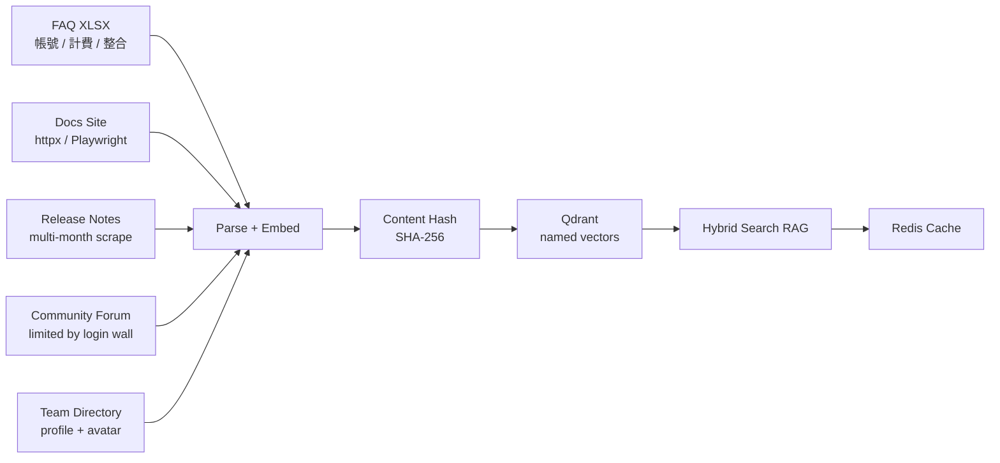



> **Abstract** — Six concrete production debugging lessons from running a multi-source RAG ingestion pipeline (FAQ + docs site + release notes + community forum + team directory) into Qdrant. Covers caller/callee contract violations, Redis cache invalidation after re-ingest, SPA `<select>` interaction quirks, deterministic UUID text-stability assumptions, full-chain failure ordering, and an honest tally of the eval debt nobody talks about.

---

## 前言

[前一篇 FAQ Hybrid Search RAG]() 講的是**搜尋端**：dense + sparse 雙路、RRF fusion、dense cosine 校準信心分數。這篇是同一個 pipeline 的**另一半** — **資料 ingestion 與運維**。

happy path 修通了不等於 production ready。本帖是從一條真實 query「下個月的 release 有什麼？」修通過程中得到的 6 個踩坑教訓 — 加上一份誠實的清單：哪些 magic number 其實從來沒人驗過，哪些 cache 還在靠手動 flush 撐著。

---

## 系統脈絡 — Multi-Source 知識庫的常見組成

把場景設定在一個 B2B SaaS 的客服知識庫。常見資料來源組成：



| 來源類型 | 抓取方式 | 範例 |
| --- | --- | --- |
| Structured Q&A | XLSX / Notion API | 客服 FAQ：帳號、計費、整合設定 |
| Docs site | httpx + BeautifulSoup | 文件首頁、定價頁、SLA 條款 |
| Time-series records | Playwright multi-month | Release notes / changelog |
| Community / Social | Playwright scroll | 公開討論串（受 login wall 限制） |
| Profile data | Playwright + image cache | On-call roster、團隊成員大頭照 |

技術 stack：**Qdrant**（named vectors: dense + sparse）+ **BGE-M3** embedding + **Redis** cache。對 FAQ 這類資料還會再加一層 **Query Expansion**（LLM 生成 N 個同義問法擴大 recall）。

---

## 6 個踩坑教訓

> 以下每一條都是某個 PR 修出來的真實故事，把專案專屬細節抽掉留下可重用的判斷。

### Lesson 1 — Library function 不該偷偷覆寫 caller 的 query

**症狀**：用戶問「下個月的 release 有什麼？」。Caller 已經做了 query enrichment — 加上產品名變成「Acme Cloud 下個月的 release」，再補一個 context 詞「changelog」湊到夠長。但 library 內部為了「temporal cleaning」把 query 整個換掉，最後 embedding 的詞只剩「release」，confidence 卡在 0.55 過不了 0.6 threshold，bot 直接轉人工。

**根因**：`rag.search()` 看到 caller 傳了 `temporal_hint`，就直接拿 `temporal_hint.cleaned_query` 取代 caller 傳進來的 `query`，把 caller 辛苦補的 enrichment 全部丟掉。

**修法**：把責任邊界拆開 — `embed_query()` 一律用 caller 傳進來的值，cleaning 由 caller 自己決定要不要做。

**Generalizable rule**：Library 不應該偷偷修改 caller 傳進來的參數。如果 cleaning 是可選 behavior，**暴露兩個 param**（`query` + `embed_query_override`）讓 caller 決定，而不是看到某個 hint 就自作主張。

```python
# Before — library 偷偷蓋掉 caller 的 query
def search(query: str, temporal_hint: Optional[TemporalHint] = None):
    if temporal_hint:
        query = temporal_hint.cleaned_query  # ← 把 caller 的 enrichment 丟掉
    embedding = embed(query)
    ...

# After — caller 決定要 embed 什麼
def search(
    query: str,
    embed_query_override: Optional[str] = None,
    temporal_hint: Optional[TemporalHint] = None,
):
    embedding = embed(embed_query_override or query)  # caller 說了算
    ...
```

---

### Lesson 2 — Re-ingest 後 Redis RAG cache 要清

**症狀**：剛把新版 release notes 重新 ingest 進 Qdrant，同樣的 query「最新版本支援 SSO 嗎」還是回舊版的答案，confidence 也是舊的低分。

**根因**：`rag.search()` 上面有一層 `rag_cache:{tenant}:{sha256(query)[:16]}`，TTL 24 小時。Re-ingest **不會**自動 invalidate 這層 cache，所以 24 小時內的 cache hit 都還在回舊資料。

**修法（短期手動 flush）**：

```bash
docker compose exec -T redis redis-cli --scan --pattern "rag_cache:*" | \
  xargs -r docker compose exec -T redis redis-cli DEL
```

**修法（長期事件化）**：Ingestion pipeline 結束時自動呼叫 `invalidate_bot_cache(tenant_id)`，或改 event-driven（ingest done → publish → cache flush consumer）。詳見後面〈Cache Invalidation〉一節。

---

### Lesson 3 — SPA 月份切換是 native `<select>` 不是 `<a>` click

**症狀**：要爬一個 changelog 站，每個月份是一個下拉選項。Playwright 用 `a:has-text("2026 / 5")` / `li:has-text("May")` 怎麼點都沒效，永遠只抓到預設月份的 entries。

**根因**：頁面是 native `<select><option value="4">May 2026</option></select>`（value 是 0-indexed）。對 `<option>` 直接 click **不會觸發 `change` event**，前端 framework（Vue / React）不會 re-render。

**修法**：

```python
# 不要用 click()，用 select_option()，會自動觸發 change event
await page.select_option("div.month-picker select", value=str(month - 1))
await page.wait_for_load_state("networkidle")
html = await page.content()
```

**Diagnostic heuristic**：SPA 導航失敗時優先看 `document.querySelectorAll('select')`。Native form controls 跟 custom UI widgets 操作方式差很多 — 前者要用 `select_option`，後者要用 `click`。**先確認是哪一種，再選工具**。

---

### Lesson 4 — Deterministic UUID 假設 parse 結果 byte-stable

**症狀**：本來 63 筆 release entries，跑兩次後 Qdrant 變 126 筆 — 預期 dedup 失效，每筆都被當成新資料 insert。

**根因**：UUID 用 `(release_date, product, version)` deterministic 生成。但兩次 scrape 的 product 字串有 trailing whitespace 或 unicode normalization 差異（例如 `"Acme Cloud"` vs `"Acme Cloud "`），UUID 就跟著不同 → Qdrant 看成兩筆不同 entry，**變成 insert 而不是 upsert**。

**修法**（三選一或全部做）：

1. 在 ingestor 端 `.strip()` 所有字串欄位（最便宜，先做這個）
2. 改用 `content_hash` 取代 `(date, key1, key2)` 組合 UUID
3. 在 ingestion side 先做 in-memory dedup（`seen_keys` set），不倚賴 Qdrant upsert collision

**Rule of thumb**：Deterministic UUID 只在 parse 結果 byte-for-byte 穩定時有效。任何 whitespace / unicode normalization / 來源網站的小改版都會破壞它。**任何用 deterministic UUID 的地方都該假設它會壞，並有 fallback dedup**。

---

### Lesson 5 — 配置型 cache 也要主動 invalidate

**症狀**：在 Admin UI 把一個過時的 forum 來源從 tenant 的 routing 裡刪掉，RAG 還是繼續搜到那個 collection 的舊內容，過了 1 分鐘才停。

**根因**：`get_bot_collections()` 之類的 routing config 也有 Redis cache（60s TTL）。Admin API 改完 config 但**沒主動 flush**，RAG 在 cache 過期前還在用舊 routing。

**修法**：所有寫 config 的 admin endpoint 都要主動 `DEL` 對應的 cache key：

```python
@router.post("/admin/tenants/{tenant_id}/sources")
async def update_sources(tenant_id: str, sources: list[str]):
    db.update_bot_sources(tenant_id, sources)
    redis.delete(f"bot_collections:{tenant_id}")  # ← 別忘了
    return {"ok": True}
```

Cache 不只是 RAG 結果要管，**配置型 cache 一樣需要 event-driven flush**。讀端只負責 read-through + TTL 兜底，寫端有義務通知讀端「我改了，請重抓」。

---

### Lesson 6 — 全鏈失敗的順序依賴

修通「下個月的 release」這條 query path，需要 4 層**同時**對：

| 層級 | 角色 | 失敗時症狀 |
| --- | --- | --- |
| L1 — Parser | 認得「下個月」/「5月」這些時間 pattern | 時間詞 miss → 沒 date filter → 撈到全歷史 |
| L2 — Data | Qdrant 有 5 月起的 changelog | Source 沒 ingest → 沒得搜 |
| L3 — Query | Caller enrichment + Library 尊重 caller | 短 query embedding 飄掉 |
| L4 — Cache | Re-ingest 後清 cache | 看到過期答案 |

**任一層失敗整個壞掉，且症狀往往看起來像同一個錯（confidence 太低）**。這就是為什麼 debug 必須**分層獨立驗證**：

1. 直接呼 `parse_temporal_query("下個月")` 確認 date range
2. `scroll` Qdrant 確認 5 月資料真的在
3. Bypass cache，直接呼 `rag.search()` 看 raw confidence
4. 比對 actual endpoint confidence 跟 bypass 結果

每多走一步看到不一樣的數字，就是某一層在做隱形的事。

---

## Bonus Pattern — Content Versioning（重複 ingest 不重做 embedding）

延伸自 Lesson 2，但更系統化的解法。對於會持續更新的 source（docs、release notes、定價頁），naïve 做法是「每次 re-ingest 全部刪掉再重灌」，但這樣有幾個問題：

- Embedding CPU 跑很久（BGE-M3 一筆 ~10ms，幾百筆就要好幾分鐘）
- Re-embedding 期間 Qdrant 是空的，搜尋會 miss
- 萬一這次 scrape 半路失敗，舊資料也救不回來

更安全的做法：**Content Hash + Skip + Orphan Cleanup + Safety Guard**。

| 機制 | 做什麼 |
| --- | --- |
| **Content Hash** | 每筆資料存 SHA-256 hash 到 Qdrant payload `content_hash` |
| **Change Detection** | Re-ingest 前比對 hash，沒變就完全跳過（省 embedding CPU） |
| **Orphan Cleanup** | 變更的 entry 先 `delete_by_filter()` 舊 chunks 再 upsert |
| **Safety Guard** | 新 scrape 文字異常短（< 50 字）但舊資料正常（> 200 字）→ 拒絕覆蓋 + WARNING |

```python
def upsert_if_changed(entry):
    new_hash = sha256(entry.text.encode()).hexdigest()
    existing_hash = qdrant.get_payload(entry.id, "content_hash")

    if new_hash == existing_hash:
        return "skipped"  # 內容沒變，省 embedding

    if len(entry.text) < MIN_TEXT_LEN and existing_hash:
        log.warning(f"new content suspiciously short, skipping: {entry.id}")
        return "guarded"  # scrape 失敗的 safety net

    qdrant.delete_by_filter({"source_id": entry.id})  # 清舊 chunks
    qdrant.upsert(
        id=entry.id,
        vector=embed(entry.text),
        payload={"text": entry.text, "content_hash": new_hash},
    )
    return "updated"
```

**Why it matters**：safety guard 救過不只一次「對方網站改版，scrape 結果變空字串」的災難 — 沒這層的話，下一次 re-ingest 會把所有 entry 直接清掉。

---

## 我們缺的不是 feature, 是 Eval Infra

Lessons 1-6 全部修完之後的真相：**所有 threshold 都是猜的，沒有 golden set 驗過**。這是大多數 RAG 專案的共同 dirty secret。

### 散落在 codebase 的 Magic Numbers

| 常數 | 現值 | 沒驗證的假設 |
| --- | --- | --- |
| `CONFIDENCE_THRESHOLD` | 0.6 | 0.55 → handoff 會少多少 false positive？沒人測過 |
| `CITATION_MIN_SCORE` | 0.5 | 給 LLM 看 score 0.5 的 citation 會不會誤導它編答案？沒人測過 |
| Changelog intent boost | ×1.3 | 1.2 vs 1.5 差別？只知道「加了比沒加好」 |
| Recency half-life | 90 天 | 高頻發版 vs 維護期同一個半衰期合理嗎？ |
| Recency weight 分級 | 1.0 / 0.8 / 0.6 / 0.5 / 0.3 | 「上一次 incident w=1.0」vs「最近 w=0.8」分級沒有 user study 支撐 |
| Query min length | < 20 / < 8 字 | 為什麼是 20 不是 15 或 25？拍腦袋 |

### 該做但還沒做的 Eval Infra

| 項目 | 為什麼非做不可 |
| --- | --- |
| **Golden query set (≥ 50 筆)** | 每次改 threshold / boost，靠 3-5 個 smoke query 驗，改 A 壞 B 完全沒感覺 |
| **Precision@3 / Recall@3** | 不知道 top-3 citation 有多少比例真的相關 |
| **Confidence calibration curve** | 找 F1 最大的 threshold，而不是「感覺 0.6 不錯」 |
| **A/B / Shadow eval** | Persona / system prompt 改版要有 rollback 機制 |

### 已知失敗模式（還沒修）

- **Cleaned query 過短** — 「下個月的 release」cleaned 後只剩「release」一字，embedding 飄掉。Workaround 是 caller 補產品名稱湊長度，正解是 embedding layer 拒絕短 query 或自動擴寫。
- **無時間詞但需要 date filter** — 「最近壞掉的 service」parser 抓不到具體日期，只能靠軟性 recency boost。正解是 intent classifier 回吐推測的日期範圍（最近 = 7 天）。
- **Temporal fallback 太激進** — 時間過濾 0 結果就把 filter 整個拿掉。應該漸進式擴大（±7 天 → ±30 天 → 移除），避免「上週的 incident」直接退化成「全歷史的 incident」。
- **Query 拼錯字 / 繁簡混用 / 中英混用** — 「下各月的 changelog」、「ticket 怎麼開」regex pattern miss，直接走 fallback。正解是 query normalization layer（繁簡轉換、常見錯字表、中英 alias）。
- **Query Expansion 生成品質未驗證** — N 倍量的 LLM 生成同義問法，沒人 sample 標註過。「重設密碼」可能被擴成「重啟伺服器」這種離題的東西也不知道。

---

## Cache Invalidation — 從手動 flush 走向 Event-Driven

Lesson 2 + Lesson 5 點出兩個 cache（RAG 結果 + 配置型）都要手動 flush，但根本問題沒解：

| 現況 | 該做 |
| --- | --- |
| Re-ingest 不會自動 flush RAG cache | Ingestion pipeline 結束時呼叫 `invalidate_bot_cache(tenant_id)` |
| Config 改動要等 60s | Admin API 改完主動 `DEL` 對應 cache key |
| 沒有 cache hit/miss metrics | 加 Prometheus counter `rag_cache_hit_total` / `_miss_total`，TTL 才有依據 |

**設計原則**：寫端負責 invalidate 讀端的 cache。讀端只負責 read-through + TTL 兜底，**不該假設「等 60 秒就會自己更新」**。當 cache 變成「正確性的 dependency」而不是「效能的 optimization」時，手動 flush 就是 production incident 在等發生。

---

## 建議的驗證順序（如果重來一次）

1. **先建 golden set（人工 ≥ 50 筆）** — 否則所有後續調整都是瞎改
2. **量測現狀 baseline** — Precision@3 / Recall@3 / confidence histogram，知道起點
3. **再動 threshold / boost** — 優先改影響最大的 `CONFIDENCE_THRESHOLD` 和 boost 倍率
4. **Cache invalidation 事件化** — 改 cache 邏輯本身也需要 eval 覆蓋才敢動
5. **最後補資料缺口** — 沒資料再怎麼調 weight 也是 recall 天花板

---

## 總結

| 教訓 | 一句話帶走 |
| --- | --- |
| L1 — Caller / callee 契約 | Library 不該偷偷覆寫 caller 傳進來的參數 |
| L2 — RAG cache | Re-ingest 後別忘了清 `rag_cache:*` |
| L3 — SPA 互動 | Native `<select>` 用 `select_option`，不是 click |
| L4 — Deterministic UUID | 假設 parse byte-stable 是脆弱前提，配 fallback dedup |
| L5 — 配置型 cache | 寫端負責 invalidate 讀端 cache |
| L6 — 全鏈順序依賴 | Debug 分層獨立驗證：parser → data → query → cache |
| Bonus — Content Versioning | Hash + Skip + Orphan Cleanup + Safety Guard |
| Eval debt | Magic number 都是猜的，先建 golden set 才有資格 tune |

**「Happy path 修通」不等於 "production ready"**。真正的 production 是：(1) eval infra 存在、(2) cache invalidation 事件化、(3) magic number 有數據背書。本帖的 6 個 lessons 都是事後諸葛 — 寫成 checklist 給未來的自己 / 同事，下次少走幾條彎路。

延伸閱讀：[FAQ Hybrid Search RAG Pipeline 實戰]() — 同一個 pipeline 的搜尋端深度實作；[RAG 挑戰與突破]() — 更廣的 RAG 全景。

---

## References

1. [Qdrant Hybrid Search](https://qdrant.tech/documentation/concepts/hybrid-queries/) — Named vectors + Prefetch + Fusion API
2. [Qdrant Filtering](https://qdrant.tech/documentation/concepts/filtering/) — Payload index + date range filter
3. [Playwright `select_option`](https://playwright.dev/python/docs/api/class-page#page-select-option) — Native `<select>` interaction
4. [BGE-M3 — BAAI](https://huggingface.co/BAAI/bge-m3) — Multi-lingual embedding model used throughout
5. [前一篇：FAQ Hybrid Search RAG]() — 搜尋端
6. [更前一篇：RAG 挑戰與突破]() — RAG 全景
