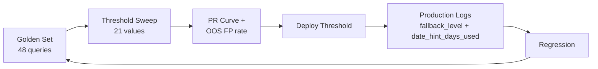



> **Abstract** — 上一篇 Production-Ready RAG Pipeline 留了三張欠條：`CONFIDENCE_THRESHOLD=0.6` 沒數據背書、soft fallback 只能二元切換、intent classifier 抓不到「近期」「新」「舊」這類語用提示。本帖把三張欠條還完 — 21-value threshold sweep 用 48 筆 golden set 證實 `0.6` 落在 F1-optimal band 內、progressive fallback 從 binary 升級為 `primary → date_30d → date_90d → no_filter` 四層並把命中 tier 寫回 `SearchResult.fallback_level`、`QueryIntent` 新增 `date_hint_days: Optional[int]`（validated 1–365）讓 classifier 為非時間詞的時序意圖吐一個回溯視窗。三個改動共同讓 pipeline 從「憑直覺調」變成「從數據回饋調」。

---

## 前言

[上一篇 Production-Ready RAG Pipeline]() 描述了三層架構 — Intent Routing、Temporal-Aware Retrieval、Calibrated Confidence — 並在 Eval Infrastructure 一節誠實列了一組 magic number 清單，同時在 `### 已知失敗模式（尚未完全修復）` 指出三個 open item：

1. **`CONFIDENCE_THRESHOLD=0.6` 沒有數據背書**。下降到 `0.55` 會把 handoff false positive 降多少？沒量過。
2. **Soft fallback 只是二元切換**：`date_filter` 命中 0 → 直接 `no_filter` 撈全歷史。時序意圖一瞬間被完全丟掉。
3. **無時間詞但意圖時間敏感**：「近期發生問題的 service」、「這陣子有什麼新變更」— regex parser 抓不到具體日期，只能靠 recency boost 軟性處理。理想做法是讓 intent classifier 回吐推測的日期範圍。

本帖用三組變更把這三個 open item 收掉，並讓每個收束都留下可觀察、可回歸的訊號。

---

## 為什麼 Magic Number 必須 Eval-Driven 收束

RAG pipeline 裡的 `0.6`、`0.5`、`1.3`、`90 天` 這類數字，常見處理方式有三種，每種都有系統性盲點：

| 做法 | 盲點 |
| --- | --- |
| **依直覺設定** | 設定者的信心是主觀的；下一位開發者看不到選值依據，不敢調也不敢留 |
| **抄他人 benchmark** | 別人的資料分佈、embedding 模型、intent mix 都與自己不同，照搬等於賭運氣 |
| **完全不設 threshold** | 不區分 high / low confidence，borderline citation 直接送進 LLM，幻覺風險被全權轉嫁給下游 |

Eval-driven 收束的核心是把每個 magic number 關聯到**一組可重跑的量測**：golden set、threshold sweep、per-tier 命中 histogram、schema validator。任何人想調整，都得先展示新的數據；任何 regression，也會在下一次 sweep 立即顯現。

今天這三個 open item 各自對應一種收束路徑：

| Open Item | 預設值 | 錯誤成本 | 收束方式 |
| --- | --- | --- | --- |
| `CONFIDENCE_THRESHOLD` | 0.6 | 高 → 誤 handoff；低 → LLM 被無關 citation 污染 | Golden set + 21-value threshold sweep |
| Fallback 範圍 | binary (filter / no_filter) | 時序意圖被整段丟掉 | 四層 progressive fallback + `fallback_level` 觀察 |
| 時間意圖推測 | parser regex | 「近期」「新」「舊」等語用提示漏抓 | Intent classifier 回吐 `date_hint_days` |

---

## 整體流程



> 三個改動並非彼此獨立 — threshold sweep 是**離線 eval 驅動**的起點；`fallback_level` 與 `date_hint_days_used` 是**線上觀察訊號**；兩者共同餵回下一輪 golden set 的擴充與 threshold 的 re-calibration。

---

## Threshold Calibration Sweep（主軸 1）

### 為什麼 `0.6` 需要驗證

Confidence 是 **threshold-independent** 的：同一次 retrieval 產生的 confidence 分數，對不同 threshold 分類結果會不同，但分數本身不變。這意味著**一次 retrieval 可以評估所有 threshold**，不需要為每個 threshold 各跑一次 Qdrant。這是 threshold sweep 能做成輕量 eval 工具的關鍵。

### Sweep 設計

- **Golden set**：48 queries，42 in-scope + 6 out-of-scope (OOS)。每個 intent category ≥ 5 筆；OOS 的作用是獨立追蹤 false positive rate，避免被整體 F1 蓋掉。
- **Sweep range**：21 values，`0.40 – 0.80`，step `0.02`。
- **Per-threshold metrics**：Precision / Recall / F1 / **OOS FP rate**。OOS FP rate 是獨立 metric，不併進總 F1。
- **執行方式**：一次完整 retrieval → 逐 threshold post-process → 所有 threshold 共用同一組 candidate 分數。
- **產出物**：`reports/threshold_sweep_<YYYYMMDD_HHMMSS>/` 含 `sweep.csv`（long-form）、`per_intent.csv`（pivot）、`pr_curve.png`、`summary.json`。

### 實際結果（2026-04-21 執行）

| Threshold | Precision | Recall | F1 | OOS FP rate | Note |
| ---: | ---: | ---: | ---: | ---: | --- |
| **0.62** | 1.000 | 1.000 | **1.000** | 0.000 | F1-optimal |
| **0.64** | 1.000 | 1.000 | **1.000** | 0.000 | F1-optimal |
| 0.54 | 0.973 | 1.000 | 0.986 | **0.167** | ⚠ OOS leakage |

### 讀表重點

- F1 在 `0.62 – 0.64` 形成 plateau。production 使用的 `0.6` 位於 plateau 左緣外一格，實務上可視為等價最優。**結論：不需要立即調整。**
- `0.54` 整體 F1 只降 1.4%，OOS FP rate 卻從 0 暴衝到 16.7%（6 筆 OOS 命中 1 筆）。**若只看 F1 會誤判為「幾乎沒差」** — 這是把 OOS 當獨立 metric 的最直接理由。
- 配合 `OOS_FP_WARNING_RATIO=0.10` 警示門檻，任何低於 `0.56` 的候選 threshold 會自動被警報擋下，不會靜悄悄合入 production。

### Sweep CLI

```bash
# 完整 sweep（~2 分鐘，retrieval-only）
python -m eval.threshold_sweep

# 快速驗證（smoke）
python -m eval.threshold_sweep --limit 10

# 跳過 per-intent classifier LLM call（省錢 / 無金鑰時）
python -m eval.threshold_sweep --no-classify-intent
```

Sweep 全程使用 `rag.search(bypass_cache=True)`，避免 Redis cache 污染結果；intent classifier 結果快取在 `reports/_intent_cache.json`，後續 re-run 可完全免費重用。

> 💡 **為什麼用 PR curve 不用 ROC？** — 在類別不平衡（in-scope 42 筆、OOS 6 筆）+ 關注 false positive cost 的情境下，ROC 的 TPR/FPR 容易被 majority class 推到左上角，minority class 的惡化被視覺掩蓋。PR curve 直接呈現 precision 對 recall 的取捨，sweep 輸出會把 top-3 F1 點標橘色方便一眼對焦。

### Sweep 目前的 limitation

- golden set 規模（48 筆）足以驗證「`0.6` 合理」，但還不足以切 per-intent threshold（每個 intent 僅 5–15 筆）。
- OOS 只有 6 筆，F1-optimal 落在 0 FP 純屬樣本邊界剛好能避開；擴到 20+ OOS 時 `OOS_FP_WARNING_RATIO` 可能需往上調。
- Re-calibration 觸發條件目前認定為：(a) golden set 擴張 > 100 筆；(b) embedding 換版；(c) Qdrant 資料量大幅變動。

---

## Progressive Fallback Tiers（主軸 2）

### Before：二元 fallback 的盲點

舊版邏輯只有兩種狀態 — `primary date_filter` 命中 ≥ 1 筆 → 用 primary；否則 → 切到 `no_filter`。問題是：

- 使用者問「上週的 incident」，primary 範圍 7 天命中 0 → 立刻退化成全歷史。回傳兩年前的 incident，confidence 可能還不低（語意很貼）。
- 時序意圖被 **all-or-nothing** 丟掉，系統看起來「有結果」，但結果已經不符合原意。

### After：四層漸進式放寬

```python
FALLBACK_TIERS = ["primary", "date_30d", "date_90d", "no_filter"]

async def hybrid_search_with_fallback(query: str, intent: QueryIntent) -> SearchResult:
    for tier in FALLBACK_TIERS:
        filter_ = build_filter(intent, tier)
        hits = await qdrant_hybrid_search(query, query_filter=filter_)
        hits = [h for h in hits if h.score >= CITATION_MIN_SCORE]
        if hits:
            return SearchResult(
                hits=hits,
                fallback_level=tier,
                winning_filter=filter_,  # dense re-score 用這個 filter，不是 primary
            )

    return SearchResult(hits=[], fallback_level="empty")
```

關鍵設計：

- **Winning filter 同步**：dense cosine re-score 用**實際命中 tier 的 filter**（`winning_filter`），不再依賴舊版在 binary fallback 裡「就地把 `date_filter` 改成 `None`」的隱性 correctness。
- **CITATION_MIN_SCORE=0.5 閾值內建**：低於此值的 hit 被過濾掉，所以 `date_90d` 命中可能是 0；此時繼續走 `no_filter`。
- **Tier 狀態完整化**：線上總共會看到 6 種 `fallback_level` 值：`primary` / `date_30d` / `date_90d` / `no_filter` / `empty` / `cached`。後兩者是簿記狀態（四層都沒過、或直接從 Redis cache 讀回）。
- **Cache prefix bump**：`rag_cache:` → `rag_cache:v2:`，避免舊版 cache payload 混入新欄位。

### 觀察性：`fallback_level` 是 explanation 不是 score

每一筆 `rag.search()` 呼叫會吐一行 `INFO`-level log：

```text
rag.search tenant=acme confidence=0.73 fallback=date_30d citations=3
```

累積一週後可以畫：

- **Fallback tier histogram**：哪種 intent 最常 degrade 到 `date_90d`？代表該 intent 的資料覆蓋有缺口。
- **`no_filter` 命中比例**：若某 intent 90% 都走 `no_filter`，該 intent 或許根本不該套 date filter。
- **`empty` 發生率**：四層全掛代表該 query pattern 超出目前知識庫範圍，應進 FAQ 補齊或 routing 到人工。

> 💡 **別把 `fallback_level` 當 confidence 的替代品** — `fallback_level` 是 **explanation**（「為什麼命中在這一層」），不是 **score**（「這筆答案多可信」）。Confidence 仍由 dense cosine re-score 決定，與 tier 邏輯正交。兩者串起來，一筆 `fallback=date_90d` + `confidence=0.42` 明顯比 `fallback=primary` + `confidence=0.78` 弱，但判斷 handoff 的 threshold 不受 fallback tier 影響。

---

## Date Hint Days — 關上 Intent Classifier 的時間盲點（主軸 3）

### 問題回顧

前帖 `已知失敗模式` 第二項：

> 無時間詞但意圖時間敏感：如「近期發生問題的 service」— parser 抓不到具體日期，目前只靠 recency boost 軟性處理。理想做法是讓 intent classifier 回吐推測的日期範圍。

純 regex parser 需要字面時間詞；「近期」「新」「舊」「這陣子」這些**語用提示**落在 classifier 的理解範圍，不該再寄望 regex 補足。

### Schema 變更

```python
class QueryIntent(BaseModel):
    category: Literal["faq", "changelog", "status", "chitchat", "handoff"]
    temporal: bool = False
    date_hint: Optional[str] = None          # 原有：具體時間詞 parse 結果
    date_hint_days: Optional[int] = Field(   # 新增：LLM 推測的回溯視窗
        None, ge=1, le=365
    )
```

Classifier 被提示為語用詞對應一個概略 window：

| 查詢暗示 | `date_hint_days` |
| --- | ---: |
| 「近期發生問題的 service」 | 14 |
| 「這陣子有什麼新變更」 | 30 |
| 「舊版的設定流程」 | 180 |
| 明確時間詞（「上週」「5月3日」） | None — 交給 parser |
| 完全無時序意圖（「怎麼改密碼」） | None |

### 防 LLM 幻覺的兩道閘

1. **Schema-level 邊界**：`ge=1, le=365` 拒絕任何負數或離譜值（實戰遇過 LLM 回 `-7` 與 `9999`）。
2. **`_parse_date_hint_days()` coercion**：非整數、超界、或 None 一律 normalize 成 `None`，不讓奇異值繞過 schema 驗證後污染 retrieval。

### 與 Progressive Fallback 串接

- `rag.search()` 只在 **temporal parser 抓不到具體 date range 時** 才使用 `date_hint_days` — parser 永遠贏。
- `date_hint_days` 決定 `primary` tier 的 filter 範圍；若 primary 命中 0，繼續走 `date_30d → date_90d → no_filter`，不會因 hint 過小困死。
- SearchResult 同時記錄 `date_hint_days_used` 與 `fallback_level`；下次 eval 看到「某筆 `primary` 空轉、退到 `date_90d` 才命中」時，能立刻判斷 hint 設太短。

### Prompt 設計注意

Classifier prompt 必須**要求 JSON schema 驗證回應**，不能寄望 free-form reply：

- `date_hint_days` 是 `Optional[int]`；classifier 不確定就回 `null`，由 pipeline 決定要不要套 filter。
- **LLM 的責任是提取語用意圖，不是決定 retrieval 策略**。策略留給 code-path。兩者職責切乾淨，任何一邊出錯都不會污染另一邊。

---

## 把三個改動串起來：Eval → Tune → Redeploy 循環

| 觸發訊號 | 動作 | 回饋 |
| --- | --- | --- |
| 新增 / 修改 threshold | 跑 `python -m eval.threshold_sweep` | PR curve + OOS FP rate |
| 新增 classifier prompt / date_hint 邏輯 | 跑同一組 golden set | Per-intent F1 + `date_hint_days_used` regression |
| 線上 `fallback_level` 分布漂移（某週 `date_90d` 比例突增） | 觸發下一輪 golden set 擴充 | 補 eval case → 下次 sweep 自動納入 |
| 線上 `empty` 率上升 | 審視知識庫缺口 | 補 FAQ / 觀察 `date_hint_days` 是否過小 |

Regression criteria 只有兩條：**F1 不下降**、**OOS FP rate 不上升**。兩條都是可重跑、可自動化的；任何人改 pipeline 都得帶著這兩條數字提 PR。

---

## Eval-Driven 檢查清單

| 項目 | Eval 驗證方式 | 現況 |
| --- | --- | --- |
| `CONFIDENCE_THRESHOLD` | 21-value sweep + PR curve + OOS FP rate | ✅ 0.62–0.64 plateau |
| Fallback 覆蓋率 | 線上 `fallback_level` histogram | ✅ per-tier 分佈可觀察 |
| Classifier 時序感知 | `date_hint_days` regression on golden set | ✅ schema + parser 雙閘 |
| Intent category accuracy | 人工標註 sample（尚未 A/B） | ⚠ 下一步 shadow eval |
| Recency half-life (90 天) | 尚未 sweep | ❌ 下一輪 eval 候選 |
| `CITATION_MIN_SCORE` (0.5) | 尚未 sweep | ❌ 與 threshold 同時 joint sweep 比較精確 |

**下一步候選**：

1. 擴充 golden set 至 ≥ 100 筆，切 per-intent threshold。
2. Recency half-life 與 `CITATION_MIN_SCORE` 的 joint sweep — 兩者有交互作用，分別 sweep 容易掉進 local optimum。
3. Persona prompt A/B shadow eval — 改 prompt 是否讓 LLM 對 borderline citation 變得更激進？目前仍未量測。

---

## 小結

三個改動共同完成一件事：把 RAG pipeline 從「發版前靠直覺、發版後靠瑞士刀」改造成「發版前跑 sweep、發版後看 histogram」。`0.6` 從此不是一個可疑的常數，而是 48 筆 golden set 背書的 plateau 中點；fallback 不再是 all-or-nothing，而是四層可觀察、可歸因的 graceful degradation；date_hint_days 則讓 intent classifier 回吐它最擅長做的事 — 從語用提示中推測使用者的時間意圖，同時把 retrieval 策略的決策權留給 code-path。

延伸閱讀：[Production-Ready RAG Pipeline]() — 本帖收束的三個 open item 出處；[FAQ Hybrid Search RAG Pipeline 實戰]() — dense + sparse + RRF + dense cosine confidence 的原始骨架。

---

## References

1. [Qdrant Hybrid Search](https://qdrant.tech/documentation/concepts/hybrid-queries/) — Named vectors + Prefetch + Fusion API
2. [Qdrant Filtering & Payload Index](https://qdrant.tech/documentation/concepts/filtering/) — Date range filter（progressive fallback 的 primary tier）
3. [BGE-M3 — BAAI](https://huggingface.co/BAAI/bge-m3) — Multi-lingual embedding throughout
4. [Reciprocal Rank Fusion (RRF)](https://plg.uwaterloo.ca/~gvcormac/cormacksigir09-rrf.pdf) — Cormack et al., SIGIR 2009
5. [Precision-Recall vs ROC in imbalanced datasets](https://journals.plos.org/plosone/article?id=10.1371/journal.pone.0118432) — Saito & Rehmsmeier, PLOS ONE 2015
6. [前一篇：Production-Ready RAG Pipeline]() — 三層架構與 open item 出處
7. [更前一篇：FAQ Hybrid Search RAG]() — hybrid search 骨架
